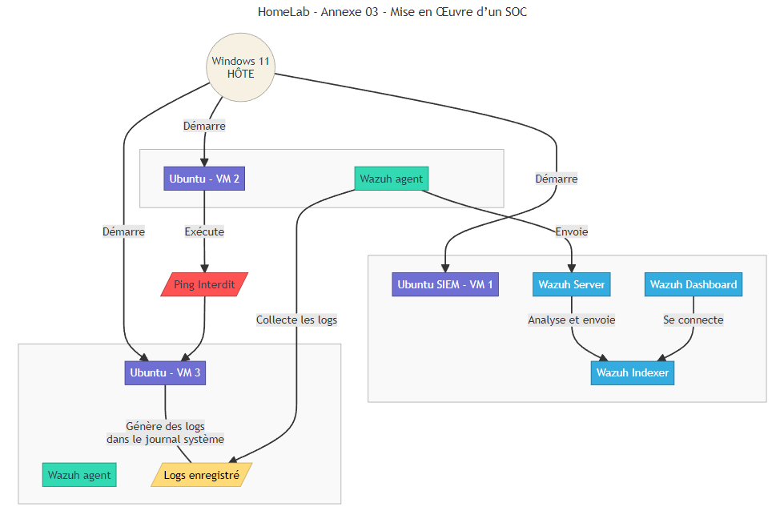
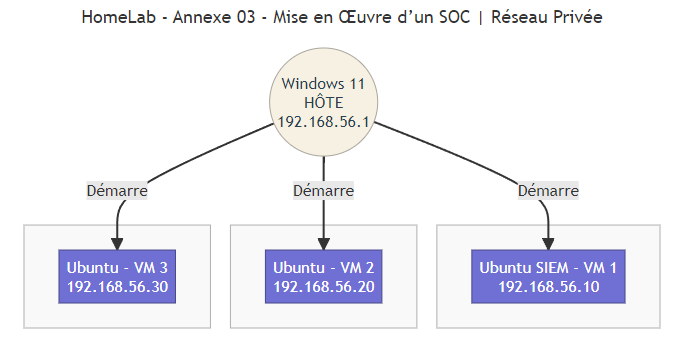

# HomeLab - Annexe 03 - Mise en Œuvre d’un SOC

Ce projet propose la mise en oeuvre d’un **Security Operations Center** (**SOC**) complet dans un environnement virtualisé, **exclusivement à partir d’outils open-source**. Chaque étape (ou homelab) s’appuie sur la précédente, afin d’offrir un apprentissage **progressif** et **opérationnel**. L’accent est mis sur la **pratique**, la **cohérence** et la **structuration** du SOC, du premier outil de surveillance réseau jusqu’à l’intégration des utilisateurs finaux sous Linux ou Windows.

<br>

## Sommaire

- [HomeLab - Annexe 03 - Mise en Œuvre d’un SOC](#homelab---annexe-03---mise-en-œuvre-dun-soc)
  - [Sommaire](#sommaire)
  - [I - Introduction générale du projet](#i---introduction-générale-du-projet)
  - [II - Problématique \& Objectifs](#ii---problématique--objectifs)
    - [A - Problématique](#a---problématique)
    - [B - Objectifs](#b---objectifs)
  - [III - Prérequis techniques](#iii---prérequis-techniques)
  - [IV - Tableau des Outils \& Concepts](#iv---tableau-des-outils--concepts)
    - [A - C'est quoi un SOC/SIEM/EDR/SOAR ?](#a---cest-quoi-un-socsiemedrsoar-)
    - [B - Outils utilisés dans mon SOC minimal](#b---outils-utilisés-dans-mon-soc-minimal)
    - [C - Outils qui peuvent-être inclus pour un socle plus complet](#c---outils-qui-peuvent-être-inclus-pour-un-socle-plus-complet)
  - [V - Structure du dépôt GitHub](#v---structure-du-dépôt-github)
  - [VI - Idée simulé du projet](#vi---idée-simulé-du-projet)
    - [A - L'idée](#a---lidée)
    - [B - Réalisation des schémas représentant l'idée du projet du soc minimale](#b---réalisation-des-schémas-représentant-lidée-du-projet-du-soc-minimale)
      - [1 - Schéma réalisé avec mermaid](#1---schéma-réalisé-avec-mermaid)
      - [2 - Schéma détaillé réalisé avec FigJam](#2---schéma-détaillé-réalisé-avec-figjam)
    - [C - Réalisation du schéma sur la configuration réseau utilisé](#c---réalisation-du-schéma-sur-la-configuration-réseau-utilisé)
  - [Introductions de mise en route](#introductions-de-mise-en-route)
  - [Ordre de déploiement et pourquoi](#ordre-de-déploiement-et-pourquoi)
  - [Perspective d'évolution possibles](#perspective-dévolution-possibles)
  - [Conclusion](#conclusion)

<br>

## I - Introduction générale du projet

Ce projet **R03-SOC** à pour objectif de mettre en oeuvre un **environnement de cybersécurité** fonctionnel utilisant uniquement des **outils open-source** afin de répondre à un besoin pour une entreprise sans financement. Le seul coût restera l'hébergement et la main d'oeuvre humaine qui permettrons de gérer chacune des parties.

Le but étant d'apprendrez à :

-   **Déployer** pas à pas les différents composants `open-source` d’un SOC.
-   **Simuler** des scénarios réels de surveillance et de réponse aux incidents.
-   **Comprendre** le rôle précis de chaque brique (`IDS/IPS`, `SIEM`, `EDR`, `SOAR`, etc.) et la manière dont elles interagissent.

Dans le climat actuel où les **menaces informatiques** évoluent en continu, la création d’un **SOC** (_Security Operations Center_) permet de couvrir la **détection**, la **surveillance** et la **réponse aux incidents de sécurité**.

<br>

## II - Problématique & Objectifs

### A - Problématique

Ma problématique se pose sur l'inconnu. J'ai eu un cours théorique très expéditif dans mon centre de formation qu'il m'était impossible sans recherche personnel de pouvoir mettre en pratique celui-ci. Mes différentes questions était ?

-   Où se positionne le SOC dans la gouvernance ?
-   Comment construire un **SOC complet** à l’aide de **logiciels open-source** ?
    -   couvrant la détection réseau
    -   la corrélation d’événements
    -   l’analyse forensique
    -   la gestion d’incidents ?

Tout en **optimisant la courbe d’apprentissage**, avec comme seules ressources:

-   une bonne connexion internet
-   une **recherche personnelle** approfondie
-   une première expérience en virtualisation ce qui m'amène à utiliser et optimiser mon ordinateur personnel.

### B - Objectifs

-   **Objectif principal**  
    Simuler en concevant et en déployant **pas à pas** une infrastructure SOC, en utilisant uniquement des solutions/outils **open-source** reconnus et libres d’utilisation.

-   **Objectifs secondaires**
    1. **Assimiler** la composante d'un SOC minimale.
    2. **Découvrir** les bases du SIEM (`Wazuh-indexer`,`Wazuh-server`,`Wazuh-dashboard`).
    3. **Comprendre sans le mettre en pratique** ici sur l'importance d'un IDS/IPS qui permettrait d'obtenir des logs plus riche. (Quelques exemple de configuration seront tout de même proposer pour configurer `Wazuh agent`).
    4. **Réaliser** l’importance de chaque brique dans le processus de **détection** et de **réponse**.
    5. **Établir** une **feuille de route** permettant de relier logiquement tous les composants (`collecte`, `analyse`, `corrélation`, `réaction`).
    6. **Apprendre la réponse à incident** et à la **forensique** via des outils tels que `Velociraptor`; `Zeek`.

Ce projet me permet de répondre avant tout au besoin **technique** lié à l'`annexe R03` que je dois réaliser afin d'acquérir **une première experience concrète** dans le déploiement et la gestion d'un SOC moderne qui pour rappel, dans mon cas, **en utilisant exclusivement des outils open-source**. Chaque composant est soigneusement sélectionné et documenté pour offrir une expérience d'apprentissage optimale, tout en respectant les standards de l'industrie ( _selon mes recherches_ ).

> **NOTE IMPORTANTE**<br>
> J'ai lors de mes tests rencontrer des problématiques majeurs lié aux droits lors de la réalisation du **homelab**.
> Pour solutionner ça, j'ai été contraint de modifier les commandes officiel pour inclure **sudo**.

<br>

## III - Prérequis techniques

1. **Connaissances préalables**

    - Administration système (`Linux` / `Windows`).
    - Notions de réseaux (`TCP/IP`, `routage`).

2. **Environnement matériel et logiciel**

    - **Vagrant** et **VirtualBox** installés et fonctionnels.
    - **Git** ( _fortement recommandé_ ) pour cloner et gérer l’évolution du projet.
    - **Configuration personnel** :

        - **RAM** : `32 GO`
        - **Système d'exploitation** : `Windows 11`
        - **Processeur** : `Intel(R) Core(TM) i5-10600KF CPU @ 4.10GHz`

> **Note**<br>
> L'image **Ubuntu 20.04** utilisées est une Image déployé par `Bento`. C'est une personne qui met à disposition de la communauté
> différentes images relativement légères en mémoire. Malgré la version **dépassées**, elle me permet de ne pas consommer trop en ressource et de permettre d'être opérationnel plus rapidement. Enfin, je déploie un **script** lors de l'installation d'une quelconque VM pour passer le système en français.

3. **Connectivité**

    - Un accès à internet, indispensable pour me permettre de télécharger les dépendances et maintenir l’environnement à jour.
    - Je utilise le réseau **BRIDGE**.

**Pourquoi BRIDGE ?**<br>
Ce type de réseau me permet de rentrer en contact avec toutes les machines virtuelles (VM) déployées, mais aussi, d'appartenir au réseau de l'hôte. En l'occurance pour moi, mon système Windows 11, ce qui me sera utile afin d'éviter de déployer une machine virtuel tournant sur windows.

**Pourquoi ne pas utiliser le réseau NAT ?**<br>
Ce type de réseau permet à chacune des machines virtuelles d'accéder à internet mais empêche la communication entre chaque machine déployée.

<br>

## IV - Tableau des Outils & Concepts

### A - C'est quoi un SOC/SIEM/EDR/SOAR ?

| **Sigle**  | **Explication**                                    | **Description**                                                                                           | **Rôle**                                                                                             |
| ---------- | -------------------------------------------------- | --------------------------------------------------------------------------------------------------------- | ---------------------------------------------------------------------------------------------------- |
| **`SOC`**  | _Security Operations Center_                       | Surveillance et réponse en continu aux incidents de sécurité.                                             | Supervision en temps réel, coordination et réponse aux attaques.                                     |
| **`SIEM`** | _Security Information and Event Management_        | Collecte, analyse et corrèle les événements de sécurité pour détecter les menaces (Wazuh en fait partie). | Centralisation et corrélation des logs pour la détection des incidents.                              |
| **`EDR`**  | _Endpoint Detection and Response_                  | Détection et réponse aux menaces spécifiques aux endpoints.                                               | Surveillance avancée des endpoints avec réponse automatisée aux menaces.                             |
| **`SOAR`** | _Security Orchestration, Automation, and Response_ | Automatise la réponse aux incidents en orchestrant les actions entre différents outils.                   | Réduction du temps de réponse aux menaces par automatisation et coordination des outils de sécurité. |

### B - Outils utilisés dans mon SOC minimal

| **Outil**          | **Catégorie**                                    | **Description**                                                                                                                                                                | **Rôle**                                                                                           | **Utilisé** |
| ------------------ | ------------------------------------------------ | ------------------------------------------------------------------------------------------------------------------------------------------------------------------------------ | -------------------------------------------------------------------------------------------------- | ----------- |
| **`Wazuh`**        | Surveillance des endpoints                       | Collecte et corrèle les logs des hôtes, détecte les intrusions et surveille le système. Filebeat collecte les logs, Wazuh Indexer les stocke et Wazuh Dashboard les visualise. | Protection des endpoints, détection de comportements suspects, centralisation et analyse des logs. | ✅          |
| **`MITRE ATT&CK`** | Cadre des tactiques et techniques des attaquants | Base de données des techniques d’attaques, intégrée à Wazuh.                                                                                                                   | Référence pour comprendre et classifier les menaces détectées.                                     | ✅          |

### C - Outils qui peuvent-être inclus pour un socle plus complet

| **Outil**          | **Catégorie**                                | **Description**                                                                                                                                                   | **Rôle**                                                                                                                                                    |
| ------------------ | -------------------------------------------- | ----------------------------------------------------------------------------------------------------------------------------------------------------------------- | ----------------------------------------------------------------------------------------------------------------------------------------------------------- |
| **`Snort`**        | Système de Prévention d'Intrusion _(IPS)_    | Snort surveille le trafic réseau et peut bloquer les activités malveillantes.<br>Similaire à Suricata, mais focalisé sur la prévention et le blocage automatique. | Prévention des menaces en bloquant les activités malveillantes en temps réel.                                                                               |
| **`Suricata`**     | Système de Détection d'Intrusion _(IDS/IPS)_ | Analyse le trafic réseau pour détecter des menaces via des règles et signatures.                                                                                  | Détection des menaces en analysant le trafic réseau.                                                                                                        |
| **`Zeek`**         | Surveillance du réseau                       | Zeek analyse les paquets réseau ( trafic ) pour détecter des comportements suspects.<br>( anomalies ou des activités malveillantes ).                             | Surveille en temps réel le réseau, génère des logs détaillés.                                                                                               |
| **`Velociraptor`** | Investigation forensique                     | Velociraptor collecte et analyse des données forensiques sur les endpoints. Permet l’examen rapide d’artefacts système (fichiers, mémoire, événements).           | Investigation forensique pour comprendre les incidents de sécurité. Approfondit l’analyse post-incident et recueille des preuves tangibles.                 |
| **`OpenCTI`**      | Gestion des renseignements sur les menaces   | OpenCTI centralise les renseignements sur les menaces pour une meilleure réponse aux incidents. (feeds externes, IoC).                                            | Centralisation et partage des renseignements sur les menaces. Ce qui améliore la connaissance des tactiques et techniques adverses pour adapter la défense. |
| **`TheHive`**      | Gestion des incidents                        | Plateforme collaborative pour suivre et coordonner la gestion des incidents de sécurité.                                                                          | Permet la gestion et l’analyse des incidents avec traçabilité.                                                                                              |
| **`Cortex`**       | Automatisation des analyses                  | Automatise les tâches d’enquête avec des analyses (hash, scans, etc.). Intégré avec TheHive.                                                                      | Automatisation des investigations pour accélérer la réponse aux incidents.                                                                                  |

<br>

## V - Structure du dépôt GitHub

Afin de comprendre chaque partie et de permettre de rendre ce homelab évolutif, j'ai initié l'idée de créer différents scripts telle que :

-   **`configure_vm.sh`** : _permet d'initier un premier paramettrage automatique lors de l'installation de la machine virtuelle._
-   **`configure_locale_fr.sh`** : _permet de configurer le système avec la langue en française._
-   **`full_system_update.sh`** : _permet d'anticiper un éventuel **snapshot** et donc il effectue une maintenance globale du système._
-   **`install_oh_my_zsh`** : _permet d'utiliser un autre shell que **bash** et d'avoir un tout autre style (touche geek)._
-   **`install_outils_x`** : _permet d'initialiser une installation spécifique ou **x** représente le nom d'un outil (`wazuh`, `snort`, `suricata`, etc.)._

> **NOTE**<br>
> La structure pour cette partie est toujours en réflexion mais l'idée étant de pouvoir simplifier l'organisation sans pour autant oublier le côté ludique du projet.

L’arborescence se présente pour le moment ainsi :

```
R03-SOC/
│
├── README.md                       # Le fichier qui est actuellement lu
├── .gitignore                      # Fichier permettant d'ignorer certains éléments permettant d'aléger le dépôt
├── Vagrantfile                     # Fichier pour créer les machines virtuelles
├── images/                         # Répertoire contenant toutes les illustrations proposées dans ce homelab
│   ├── configuration_reseau.png
│   ├── schema_homelab_détaillés.jpg
│   ├── schema_homelab.png
├── schema/                         # Répertoire contenant toutes les schemas réaliser au format mermaid
│   ├── configuration_reseau.mmd
│   ├── schema_homelab.png
├── shared/                         # Répertoire communs à toutes les VMs
│   ├── config/
│   │   ├── configure_locale_fr.sh  # Permet de passer le système en Français
│   │   ├── configure_vm.sh         # Permet de configuer la/(les) machine(s) virtuelle(s)
│   ├── scripts/
│   │   ├── install_oh_my_zsh.sh    # Permet d'installer ZSH puis OH MY ZSH
│   │   ├── install_snort.sh        # Permet d'installer l'outil SNORT
│   │   ├── install_suricata.sh     # Permet d'installer l'outil SURICATA
│   │   ├── install_wazuh.sh        # Permet de télécharger l'assistant d'installation de WAZUH
└── └── └── ...
```

<br>

## VI - Idée simulé du projet

### A - L'idée

Le projet ici consiste à créer tois (3) machines virtuelles avec comme sujet :

    -   Le mot d'ordre de l'entreprise est simple : **LE PING ENTRE LES MACHINES EST STRICTEMENT INTERDIT**

Ainsi, le but étant de générer des logs selon toute tentative de ping et permettre
de les intercepter et de les afficher dans le dashboard de wazuh.

1. Une VM (**siem**) avec `wazuh-indexer`, `wazuh-server`, `wazuh-dashboard`.
2. Une VM (**attaquante**) avec `wazuh-agent` qui aura été installé et qui **ne déclenchera aucun log**.
3. Une VM (**cible**) avec également `wazuh-agent` qui aura été installé et qui déclenchera des logs qui seront envoyé à `wazuh-server`.

### B - Réalisation des schémas représentant l'idée du projet du soc minimale

#### 1 - Schéma réalisé avec mermaid



#### 2 - Schéma détaillé réalisé avec FigJam


### C - Réalisation du schéma sur la configuration réseau utilisé



<br>

## Introductions de mise en route

<br>

## Ordre de déploiement et pourquoi

<br>

## Perspective d'évolution possibles

<br>

## Conclusion
