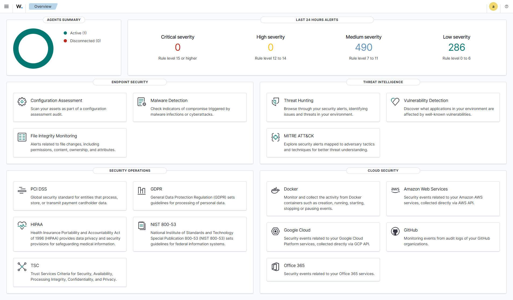
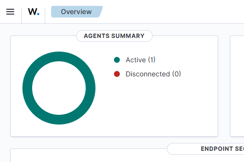
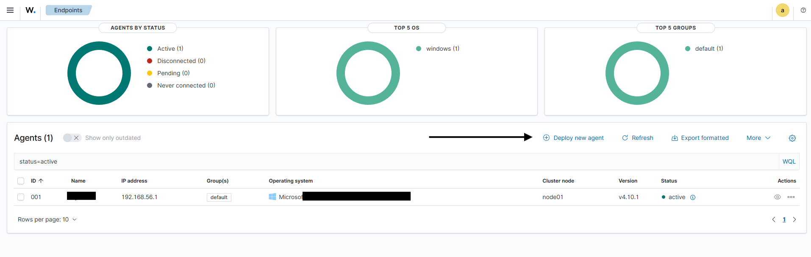
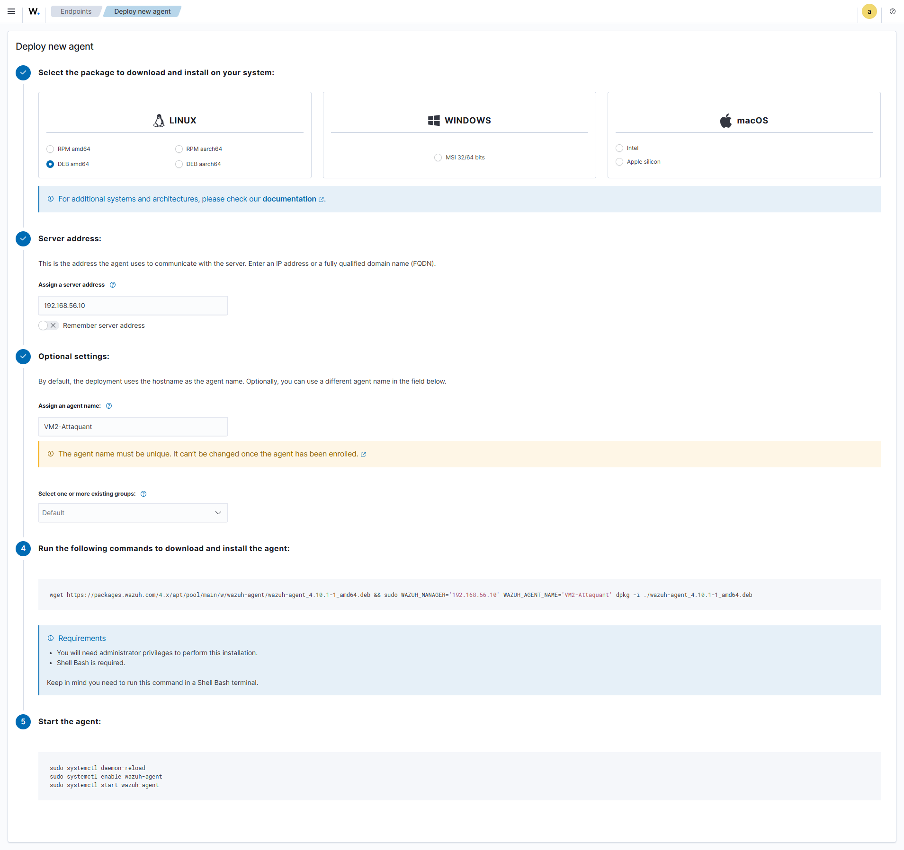
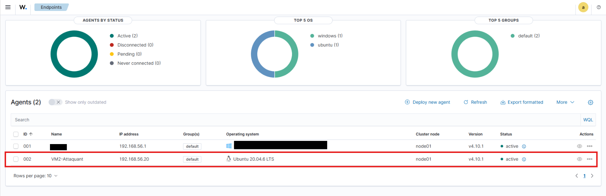
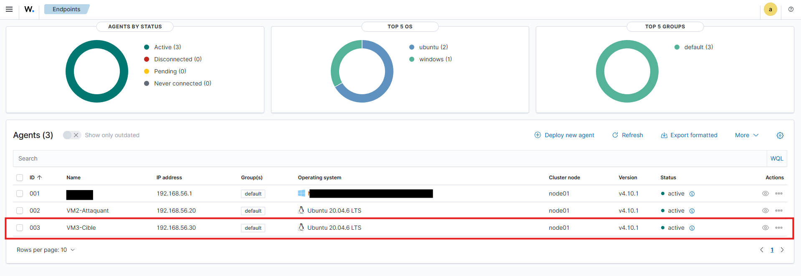

# HomeLab - Annexe 03 - Mise en Œuvre d’un SOC

Ce projet propose la mise en oeuvre d’un **Security Operations Center** (**SOC**) complet dans un environnement virtualisé, **exclusivement à partir d’outils open-source**. Chaque étape (ou homelab) s’appuie sur la précédente, afin d’offrir un apprentissage **progressif** et **opérationnel**. L’accent est mis sur la **pratique**, la **cohérence** et la **structuration** du SOC, du premier outil de surveillance réseau jusqu’à l’intégration des utilisateurs finaux sous Linux ou Windows.

<br>

## Sommaire

- [HomeLab - Annexe 03 - Mise en Œuvre d’un SOC](#homelab---annexe-03---mise-en-œuvre-dun-soc)
  - [Sommaire](#sommaire)
  - [I - Introduction générale du projet](#i---introduction-générale-du-projet)
  - [II - Problématique rencontré](#ii---problématique-rencontré)
  - [III - Objectifs](#iii---objectifs)
  - [IV - Prérequis techniques](#iv---prérequis-techniques)
  - [V - Tableau des Outils \& Concepts](#v---tableau-des-outils--concepts)
    - [A - Que signifie un SOC/SIEM/EDR/SOAR ?](#a---que-signifie-un-socsiemedrsoar-)
    - [B - Quels sont les outils utilisés pour mon SOC minimal](#b---quels-sont-les-outils-utilisés-pour-mon-soc-minimal)
    - [C - Quels sont les outils qui peuvent-être inclus pour un socle plus complet](#c---quels-sont-les-outils-qui-peuvent-être-inclus-pour-un-socle-plus-complet)
  - [VI - Structure du dépôt GitHub (Ce Homelab)](#vi---structure-du-dépôt-github-ce-homelab)
  - [VII - Énoncé simulé mais réaliste](#vii---énoncé-simulé-mais-réaliste)
    - [A - Explications](#a---explications)
    - [B - Réalisation des schémas représentant l'idée du projet du soc minimale](#b---réalisation-des-schémas-représentant-lidée-du-projet-du-soc-minimale)
      - [1 - Schéma réalisé avec mermaid](#1---schéma-réalisé-avec-mermaid)
      - [2 - Schéma détaillé réalisé avec FigJam](#2---schéma-détaillé-réalisé-avec-figjam)
    - [C - Réalisation du schéma sur la configuration réseau utilisé](#c---réalisation-du-schéma-sur-la-configuration-réseau-utilisé)
  - [VIII - Déploiements des nombreux scripts déjà préparés en amont](#viii---déploiements-des-nombreux-scripts-déjà-préparés-en-amont)
    - [A - Scripts utilisés lors de l'installation des VMs.](#a---scripts-utilisés-lors-de-linstallation-des-vms)
    - [B - Scripts utilisés pour télécharger l'assistant d'installation de wazuh pour le SIEM uniquement](#b---scripts-utilisés-pour-télécharger-lassistant-dinstallation-de-wazuh-pour-le-siem-uniquement)
  - [IX - Création du Vagrantfile](#ix---création-du-vagrantfile)
    - [A - Création du fichier](#a---création-du-fichier)
    - [B - Vérification de la bonne conformité Vagrantfile](#b---vérification-de-la-bonne-conformité-vagrantfile)
    - [C - Déploiement des VMs](#c---déploiement-des-vms)
    - [D - Résultat d'un déploiement en une seule commande :](#d---résultat-dun-déploiement-en-une-seule-commande-)
    - [E - Démarrage de la première VM (_SIEM_)](#e---démarrage-de-la-première-vm-siem)
  - [X - Installation de Wazuh sur le SIEM (_VM1_)](#x---installation-de-wazuh-sur-le-siem-vm1)
  - [XI - Découverte du dashboard de Wazuh](#xi---découverte-du-dashboard-de-wazuh)
    - [A - Premier démarrage du dashboard](#a---premier-démarrage-du-dashboard)
    - [B - Ajout d'un Agent à partir du dashboard de Wazuh.](#b---ajout-dun-agent-à-partir-du-dashboard-de-wazuh)
    - [C - Résultats obtenus](#c---résultats-obtenus)
  - [XII - Exemple de règle officiel pour établir quelques tests](#xii---exemple-de-règle-officiel-pour-établir-quelques-tests)
    - [A - Détection des processus non autorisés (_officiel_)](#a---détection-des-processus-non-autorisés-officiel)
      - [1 - Configuration d'un Agent (_wazuh-agent_) - (_machine sur linux_)](#1---configuration-dun-agent-wazuh-agent---machine-sur-linux)
      - [2 - Configuration du Server (_wazuh-server_) - (_machine sur linux SIEM_)](#2---configuration-du-server-wazuh-server---machine-sur-linux-siem)
      - [3 - Émulation d'attaque - (_Machine sur linux et plus précisément celle attaquante_)](#3---émulation-dattaque---machine-sur-linux-et-plus-précisément-celle-attaquante)
      - [4 - visualisation des alertes sur le dashboard de wazuh](#4---visualisation-des-alertes-sur-le-dashboard-de-wazuh)
  - [XIII - Mise en place de la solution pour répondre au projet](#xiii---mise-en-place-de-la-solution-pour-répondre-au-projet)
    - [A - Section WAZUH-AGENT (Configuration)](#a---section-wazuh-agent-configuration)
      - [bonus - Vérification de l'existance de l'outil "tcpdump" sur le système](#bonus---vérification-de-lexistance-de-loutil-tcpdump-sur-le-système)
    - [B - Section WAZUH-SERVER (Détection et Règles)](#b---section-wazuh-server-détection-et-règles)
      - [1 - Création de la règle (rule)](#1---création-de-la-règle-rule)
      - [2 - Configuration du Webhook Discord (gravité de niveau 6)](#2---configuration-du-webhook-discord-gravité-de-niveau-6)
      - [3 - Configuration de l'envoie d'un Email (gravité de niveau 12)](#3---configuration-de-lenvoie-dun-email-gravité-de-niveau-12)
    - [C - Emulation de l'attaque](#c---emulation-de-lattaque)
      - [1 - Déclenchement du webhook discord](#1---déclenchement-du-webhook-discord)
      - [2 - Visualisation des données d'alerte dans le dashboard.](#2---visualisation-des-données-dalerte-dans-le-dashboard)
  - [XIV - Perspectives et évolutions possibles](#xiv---perspectives-et-évolutions-possibles)
  - [XV - Conclusion](#xv---conclusion)

<br>

## I - Introduction générale du projet

Ce projet **R03-SOC** à pour objectif de mettre en oeuvre un **environnement de cybersécurité** fonctionnel utilisant uniquement des **outils open-source** afin de répondre à un besoin pour une entreprise sans financement. Le seul coût restera l'hébergement et la main d'oeuvre humaine qui permettrons de gérer chacune des parties.

Le but étant d'apprendrez à :

-   **Déployer** pas à pas les différents composants `open-source` d’un SOC.
-   **Simuler** des scénarios réels de surveillance et de réponse aux incidents.
-   **Comprendre** le rôle précis de chaque brique (`IDS/IPS`, `SIEM`, `EDR`, `SOAR`, etc.) et la manière dont elles interagissent.

Dans le climat actuel où les **menaces informatiques** évoluent en continu, la création d’un **SOC** (_Security Operations Center_) permet de couvrir la **détection**, la **surveillance** et la **réponse aux incidents de sécurité**.

<br>

## II - Problématique rencontré

Ma problématique se pose sur l'inconnu. J'ai eu un cours théorique très expéditif dans mon centre de formation qu'il m'était impossible sans recherche personnel de pouvoir mettre en pratique celui-ci. Mes différentes questions était ?

-   Où se positionne le SOC dans la gouvernance ?
-   Comment construire un **SOC complet** à l’aide de **logiciels open-source** ?
    -   couvrant la détection réseau
    -   la corrélation d’événements
    -   l’analyse forensique
    -   la gestion d’incidents ?

Tout en **optimisant la courbe d’apprentissage**, avec comme seules ressources:

-   une bonne connexion internet
-   une **recherche personnelle** approfondie
-   une première expérience en virtualisation ce qui m'amène à utiliser et optimiser mon ordinateur personnel.

## III - Objectifs

-   **Objectif principal**  
    Simuler en concevant et en déployant **pas à pas** une infrastructure SOC, en utilisant uniquement des solutions/outils **open-source** reconnus et libres d’utilisation.

-   **Objectifs secondaires**
    1. **Assimiler** la composante d'un SOC minimale.
    2. **Découvrir** les bases du SIEM (`Wazuh-indexer`,`Wazuh-server`,`Wazuh-dashboard`).
    3. **Comprendre sans le mettre en pratique** ici sur l'importance d'un IDS/IPS qui permettrait d'obtenir des logs plus riche. (Quelques exemple de configuration seront tout de même proposer pour configurer `Wazuh agent`).
    4. **Réaliser** l’importance de chaque brique dans le processus de **détection** et de **réponse**.
    5. **Établir** une **feuille de route** permettant de relier logiquement tous les composants (`collecte`, `analyse`, `corrélation`, `réaction`).
    6. **Apprendre la réponse à incident** et à la **forensique** via des outils tels que `Velociraptor`; `Zeek`.

Ce projet me permet de répondre avant tout au besoin **technique** lié à l'`annexe R03` que je dois réaliser afin d'acquérir **une première experience concrète** dans le déploiement et la gestion d'un SOC moderne qui pour rappel, dans mon cas, **en utilisant exclusivement des outils open-source**. Chaque composant est soigneusement sélectionné et documenté pour offrir une expérience d'apprentissage optimale, tout en respectant les standards de l'industrie ( _selon mes recherches_ ).

> **NOTE IMPORTANTE**<br>
> J'ai lors de mes tests rencontrer des problématiques majeurs lié aux droits lors de la réalisation du **homelab**.
> Pour solutionner ça, j'ai été contraint de modifier les commandes officiel pour inclure **sudo**.

<br>

## IV - Prérequis techniques

1. **Connaissances préalables**

    - Administration système (`Linux` / `Windows`).
    - Notions de réseaux (`TCP/IP`, `routage`).

2. **Environnement matériel et logiciel**

    - **Vagrant** et **VirtualBox** installés et fonctionnels.
    - **Git** ( _fortement recommandé_ ) pour cloner et gérer l’évolution du projet.
    - **Configuration personnel** :

        - **RAM** : `32 GO`
        - **Système d'exploitation** : `Windows 11`
        - **Processeur** : `Intel(R) Core(TM) i5-10600KF CPU @ 4.10GHz`

> **Note**<br>
> L'image **Ubuntu 22.04** utilisées est une Image déployé par `Bento`. C'est une personne qui met à disposition de la communauté
> différentes images relativement légères en mémoire. Malgré la version **dépassées**, elle me permet de ne pas consommer trop en ressource et de permettre d'être opérationnel plus rapidement. Enfin, je déploie un **script** lors de l'installation d'une quelconque VM pour passer le système en français.

3. **Connectivité**

    - Un accès à internet, indispensable pour me permettre de télécharger les dépendances et maintenir l’environnement à jour.
    - Je utilise le réseau **BRIDGE**.

**Pourquoi BRIDGE ?**<br>
Ce type de réseau me permet de rentrer en contact avec toutes les machines virtuelles (VM) déployées, mais aussi, d'appartenir au réseau de l'hôte. En l'occurance pour moi, mon système Windows 11, ce qui me sera utile afin d'éviter de déployer une machine virtuel tournant sur windows.

**Pourquoi ne pas utiliser le réseau NAT ?**<br>
Ce type de réseau permet à chacune des machines virtuelles d'accéder à internet mais empêche la communication entre chaque machine déployée.

<br>

## V - Tableau des Outils & Concepts

### A - Que signifie un SOC/SIEM/EDR/SOAR ?

| **Sigle**  | **Explication**                                    | **Description**                                                                                           | **Rôle**                                                                                             |
| ---------- | -------------------------------------------------- | --------------------------------------------------------------------------------------------------------- | ---------------------------------------------------------------------------------------------------- |
| **`SOC`**  | _Security Operations Center_                       | Surveillance et réponse en continu aux incidents de sécurité.                                             | Supervision en temps réel, coordination et réponse aux attaques.                                     |
| **`SIEM`** | _Security Information and Event Management_        | Collecte, analyse et corrèle les événements de sécurité pour détecter les menaces (Wazuh en fait partie). | Centralisation et corrélation des logs pour la détection des incidents.                              |
| **`EDR`**  | _Endpoint Detection and Response_                  | Détection et réponse aux menaces spécifiques aux endpoints.                                               | Surveillance avancée des endpoints avec réponse automatisée aux menaces.                             |
| **`SOAR`** | _Security Orchestration, Automation, and Response_ | Automatise la réponse aux incidents en orchestrant les actions entre différents outils.                   | Réduction du temps de réponse aux menaces par automatisation et coordination des outils de sécurité. |

### B - Quels sont les outils utilisés pour mon SOC minimal

| **Outil**          | **Catégorie**                                    | **Description**                                                                                                                                                                | **Rôle**                                                                                           | **Utilisé** |
| ------------------ | ------------------------------------------------ | ------------------------------------------------------------------------------------------------------------------------------------------------------------------------------ | -------------------------------------------------------------------------------------------------- | ----------- |
| **`Wazuh`**        | Surveillance des endpoints _(SIEM)_              | Collecte et corrèle les logs des hôtes, détecte les intrusions et surveille le système. Filebeat collecte les logs, Wazuh Indexer les stocke et Wazuh Dashboard les visualise. | Protection des endpoints, détection de comportements suspects, centralisation et analyse des logs. | ✅          |
| **`MITRE ATT&CK`** | Cadre des tactiques et techniques des attaquants | Base de données des techniques d’attaques, intégrée à Wazuh.                                                                                                                   | Référence pour comprendre et classifier les menaces détectées.                                     | ✅          |

### C - Quels sont les outils qui peuvent-être inclus pour un socle plus complet

| **Outil**          | **Catégorie**                                | **Description**                                                                                                                                                   | **Rôle**                                                                                                                                                    |
| ------------------ | -------------------------------------------- | ----------------------------------------------------------------------------------------------------------------------------------------------------------------- | ----------------------------------------------------------------------------------------------------------------------------------------------------------- |
| **`Suricata`**     | Système de Détection d'Intrusion _(IDS/IPS)_ | Analyse le trafic réseau pour détecter des menaces via des règles et signatures.                                                                                  | Détection des menaces en analysant le trafic réseau.                                                                                                        |
| **`Snort`**        | Système de Prévention d'Intrusion _(IPS)_    | Snort surveille le trafic réseau et peut bloquer les activités malveillantes.<br>Similaire à Suricata, mais focalisé sur la prévention et le blocage automatique. | Prévention des menaces en bloquant les activités malveillantes en temps réel.                                                                               |
| **`Zeek`**         | Surveillance du réseau                       | Zeek analyse les paquets réseau ( trafic ) pour détecter des comportements suspects.<br>( anomalies ou des activités malveillantes ).                             | Surveille en temps réel le réseau, génère des logs détaillés.                                                                                               |
| **`Velociraptor`** | Investigation forensique                     | Velociraptor collecte et analyse des données forensiques sur les endpoints. Permet l’examen rapide d’artefacts système (fichiers, mémoire, événements).           | Investigation forensique pour comprendre les incidents de sécurité. Approfondit l’analyse post-incident et recueille des preuves tangibles.                 |
| **`OpenCTI`**      | Gestion des renseignements sur les menaces   | OpenCTI centralise les renseignements sur les menaces pour une meilleure réponse aux incidents. (feeds externes, IoC).                                            | Centralisation et partage des renseignements sur les menaces. Ce qui améliore la connaissance des tactiques et techniques adverses pour adapter la défense. |
| **`TheHive`**      | Gestion des incidents                        | Plateforme collaborative pour suivre et coordonner la gestion des incidents de sécurité.                                                                          | Permet la gestion et l’analyse des incidents avec traçabilité.                                                                                              |
| **`Cortex`**       | Automatisation des analyses                  | Automatise les tâches d’enquête avec des analyses (hash, scans, etc.). Intégré avec TheHive.                                                                      | Automatisation des investigations pour accélérer la réponse aux incidents.                                                                                  |

<br>

## VI - Structure du dépôt GitHub (Ce Homelab)

Afin de comprendre chaque partie et de permettre de rendre ce homelab évolutif, j'ai initié l'idée de créer différents scripts telle que :

-   **`configure_vm.sh`** : _permet d'initier un premier paramettrage automatique lors de l'installation de la machine virtuelle._
-   **`configure_locale_fr.sh`** : _permet de configurer le système avec la langue en française._
-   **`full_system_update.sh`** : _permet d'anticiper un éventuel **snapshot** et donc il effectue une maintenance globale du système._
-   **`install_oh_my_zsh`** : _permet d'utiliser un autre shell que **bash** et d'avoir un tout autre style (touche geek)._
-   **`install_outils_x`** : _permet d'initialiser une installation spécifique ou **x** représente le nom d'un outil (`wazuh`, `snort`, `suricata`, etc.)._

> **NOTE**<br>
> La structure pour cette partie est toujours en réflexion mais l'idée étant de pouvoir simplifier l'organisation sans pour autant oublier le côté ludique du projet.

L’arborescence se présente pour le moment ainsi :
_Je me donne le droit de la modifier à tout moment_

```
R03-SOC/
│
├── README.md                       # Le fichier qui est actuellement lu
├── .gitignore                      # Fichier permettant d'ignorer certains éléments permettant d'aléger le dépôt
├── Vagrantfile                     # Fichier pour créer les machines virtuelles
├── images/                         # Répertoire contenant toutes les illustrations proposées dans ce homelab
│   ├── configuration_reseau.png
│   ├── schema_homelab_détaillés.jpg
│   ├── schema_homelab.png
├── schema/                         # Répertoire contenant toutes les schemas réaliser au format mermaid
│   ├── configuration_reseau.mmd
│   ├── schema_homelab.png
├── shared/                         # Répertoire communs à toutes les VMs
│   ├── config/
│   │   ├── configure_locale_fr.sh  # Permet de passer le système en Français
│   │   ├── configure_vm.sh         # Permet de configuer la/(les) machine(s) virtuelle(s)
│   ├── scripts/
│   │   ├── install_oh_my_zsh.sh    # Permet d'installer ZSH puis OH MY ZSH
│   │   ├── install_snort.sh        # Permet d'installer l'outil SNORT
│   │   ├── install_suricata.sh     # Permet d'installer l'outil SURICATA
│   │   ├── install_wazuh.sh        # Permet de télécharger l'assistant d'installation de WAZUH
└── └── └── ...
```

## VII - Énoncé simulé mais réaliste

### A - Explications

La société X dispose d'un petit parc informatique constitué de 3 postes informatiques :

-   `client n°1 windows 11` _Hôte du homelab afin de gagner en ressource_
-   `client n°2 Ubuntu 22.04` _Attaquant_
-   `Server Ubuntu 22.04` _cible_

Pour des raisons qui leurs appartienent, une désision forte à été prise pour éviter toute attaque.
Il s'agit tout simplement <mark>**d'interdir toute tentative de ping vers les machines du réseau**</mark>.

Pour mener à bien ce projet, un **SOC** a été demandé pour répondre au besoin et de permettre de solutionner ce besoin.
Ainsi, il a été décidé d'ouvrir `Un nouveau serveur qui contiendra un SIEM`.
Le but recherché est simplement de collecter les logs qui auront été généré par un agent.
Cet agent, devra envoyer au manager (_server-wazuh_ qui **n'existe pas**) les logs formatés.

> **ATTENTION**<br>
> Si un **PING (_ICMP_)** est détecté une fois, alors une alerte est envoyé sur un channel appelé "alert-wazuh" sur un server discord privée.
> Si cette même alerte est lancée plus de 5x alors une alerte de niveau 12 est alors déclenché et donc,
> un email est envoyé vers un responsable qui traitera directement l'information (_smtp_gmail_).

Le but étant de solutionner rapidement l'information tout en ayant une traçabilité pour prouver toute tentative malveillante
de tel ou tel utilisateur.

### B - Réalisation des schémas représentant l'idée du projet du soc minimale

#### 1 - Schéma réalisé avec mermaid


#### 2 - Schéma détaillé réalisé avec FigJam


### C - Réalisation du schéma sur la configuration réseau utilisé


<br>

## VIII - Déploiements des nombreux scripts déjà préparés en amont

### A - Scripts utilisés lors de l'installation des VMs.

Liste des fichiers qui ont été déployé dans le répertoire `server/config/`

-   **`configure_vm.sh`** : _Permet d'installer Postfix et d'éviter que l'installation ne plante._
-   **`configure_locale_fr.sh`** : _Comme expliquer précédemment, ce script permet de passer le système en français._

Ces fichiers sont indispensable pour le Vagrantfile.
Les autres scripts arriveront apès la rédaction du Vagrantfile.

### B - Scripts utilisés pour télécharger l'assistant d'installation de wazuh pour le SIEM uniquement

Dans la première VM (**SIEM**), il est question dans le Vagrantfile d'avoir un script pour télécharger l'assistant de wazuh (**wazuh-install.sh**). Pour ça le script a été déployé dans le répertoire `shared/scripts/`

-   **`install_wazuh.sh`** : _Permet de télécharger l'assistant d'installation de Wazuh._

<br>

## IX - Création du Vagrantfile

Ce fichier est fondamentale à la bonne installation du homelab. Tout découle de sa configuration entièrement automatisé.

### A - Création du fichier

```rb
# -*- mode: ruby -*-
# vi: set ft=ruby :

# Définition des variables d'environnement
def get_first_bridge_interface
  # Obtenir la liste des interfaces
  bridges = `VBoxManage list bridgedifs`
  # Trouver la première interface qui n'est pas Hyper-V
  bridges.split("\n").each do |line|
    if line.start_with?("Name:") && !line.include?("Hyper-V")
      return line.split(":")[1].strip.gsub('"', '')
    end
  end
  nil
end

# Permet d'éviter toute intéraction avec l'utilisateur
# dans le choix de l'interface réseau
BRIDGE_INTERFACE = get_first_bridge_interface()

# Définition du mode réseau (privé recommandé)
NETWORK_MODE = "private_network" # Peut être "public_network" si nécessaire

# Configuration des VMs
NODES = {
  'vm1' => {
    hostname: 'r03-vm1-siem',
    ip_public: '10.0.2.10',
    ip_private: '192.168.56.10',
    memory: 8192,
    cpus: 4,
    scripts: ['wazuh']
  },
  'vm2' => {
    hostname: 'r03-vm2-attaquant',
    ip_public: '10.0.2.20',
    ip_private: '192.168.56.20',
    memory: 2048,
    cpus: 2,
    scripts: []
  },
  'vm3' => {
    hostname: 'r03-vm3-cible',
    ip_public: '10.0.2.30',
    ip_private: '192.168.56.30',
    memory: 2048,
    cpus: 2,
    scripts: []
  }
}

Vagrant.configure("2") do |config|

  NODES.each do |node_name, node_config|
    config.vm.define node_name do |node|

      # Configuration de base
      node.vm.box = "bento/ubuntu-22.04"
      node.vm.hostname = node_config[:hostname]

      # Configuration du provider VirtualBox
      node.vm.provider "virtualbox" do |vb|
        vb.name = "Homelab-vagrant-[R03]-[#{node_name}]"
        vb.memory = node_config[:memory]
        vb.cpus = node_config[:cpus]
      end

      # Configuration réseau (privé recommandé)
      if NETWORK_MODE == "public_network"
        node.vm.network "public_network", ip: node_config[:ip_public], auto_config: true, bridge: BRIDGE_INTERFACE
      else
        node.vm.network "private_network", ip: node_config[:ip_private], auto_config: true, bridge: BRIDGE_INTERFACE
      end

      # Dossier partagé
      node.vm.synced_folder "shared", "/home/vagrant/shared"

      # Scripts de provisioning communs
      node.vm.provision "shell", path: "server/config/configure_locale_fr.sh"
      node.vm.provision "shell", path: "server/config/configure_vm.sh"

      # Scripts spécifiques pour installer ou télécharger des outils
      node_config[:scripts].each do |script|
        node.vm.provision "shell", path: "shared/scripts/install_#{script}.sh"
      end
    end
  end

end
```

### B - Vérification de la bonne conformité Vagrantfile

```bash
# Contrôler la validité du Vagrantfile avec la commande :
vagrant validate # Doit retourner -> "Vagrantfile validated successfully."
```

### C - Déploiement des VMs

Le déploiement des VM se fait de deux façons (_mon choix se porte sur la première façon_) :

```bash
# 1 - Déploiement en une seule fois
vagrant up

# 2 - Déploiement VM / VM
vagrant up <nom_vm> # pour mon cas c'est vm1 || vm2 || vm3
```

**Si une erreur**

```bash
# Stop toutes les VMs démarrer
vagrant halt

# Stop exclusivement qu'une VM
vagrant halt <nom_vm>
```

**Supprimer les VMs**

```bash
# Supprimer toutes les VMs
vagrant destroy -f

# Supprimer qu'une VM
vagrant destroy -f <name_vm>
```

### D - Résultat d'un déploiement en une seule commande :


_figure : 3 VMs reconnus et installation de la première_

<br>


_figure : Installation de la langue française sur la VM1_

<br>


_figure : Enchaînement sur l'installation de Postfix_

<br>


_figure : Fin d'installation de la VM1 et passage à l'installation de la VM2_

<br>


_figure : Fin d'installation de la VM2 et passage à l'installation de la VM3_

> **NOTE IMPORTANTE**<br>
> Il faut remarquer ici que le script concernant le téléchargement de l'assistant d'installation de wazuh ne s'est pas déclenché à la fin de l'installation de Postfix sur la VM2.

<br>


_figure : Fin d'installation de la VM3. **Aucune erreur !!**_

Les trois machines virtuelles sont prête et disponible dans Virtualbox. (`On ne lancera pas les VM de là.`).


### E - Démarrage de la première VM (_SIEM_)

Le But ici est de lancer la première VM et de contrôler quelques étapes importante.
Pour ce faire je lance la commande :

```bash
# Se connecter en ssh sur "vm1"
vagrant ssh vm1
```

**Les étapes à contrôler** (_Si cocher c'est que c'est validé_) :

-   [x] Mettre à jour tout les paquets
-   [x] Mettre à niveau tout les paquets (upgrade)
-   [x] Supprimer tout les programmes vide

    ```bash
    # Ces trois vérifications peuvent se faire en une commande
    sudo apt update -y && sudo apt full-upgrade -y && sudo apt autoremove -y
    ```

-   [x] Contrôler la présence du script **`wazuh-install.sh`**
    ```bash
    # Affiche la liste des fichiers
    ls
    ```
-   [x] Connaître l'IP de la machine virtuelle pour savoir si elle correspond bien à `192.168.56.10`. avec la commande :
    ```bash
    # Affiche l'ip de la machine
    ip a
    ```
-   [x] Ping la VM2 (`192.168.56.20`)
    ```bash
    # Ping sur la VM2 en définissant un nombre de paquet avec l'option -c
    ping 192.168.56.20 -c 3
    ```
-   [x] Ping la VM3 (`192.168.56.30`)
    ```bash
    # Ping sur la VM3 en définissant un nombre de paquet avec l'option -c
    ping 192.168.56.30 -c 3
    ```

<br>

## X - Installation de Wazuh sur le SIEM (_VM1_)

Rien de plus simple, les contrôles précédends ayant été réussi avec succès,<br>
il suffit d'exécuter le script d'instalation et d'attendre que tout est bien installé.

> **NOTE IMPORTANTE**<br>
> L'installation prendra un peu de temps et parfois on a l'impression que celle-ci a planté.<br>
> Mais dans les faits, il n'en ai rien et il faut prendre son mal en patience.

```bash
# Toujours au même endroit sans s'être déplacer dans un dossier, on exécute le script d'installation de l'assistant avec la commande :
sudo bash wazuh-install.sh -a
```

> **NOTE IMPORTANTE**<br> > _**L'identifiant et le mot de passe de connexion au dashboard de Wazuh sera communiquer à la fin de l'installation.**_<br> > **Il faut penser à l'inclure dans le `.env` situé à la racine du projet.**

**Fichier .env** :

```perl
# Identifiant pour le Wazuh Dashboard
WAZUH_DASBOARD_USER=""
WAZUH_DASBOARD_PASSWORD=""
```


> **NOUVELLE NOTE**<br> _Comme je l'ai évoqué, l'installation de cette partie est très longue._<br> > _J'enticipe donc pour ouvrir deux autres terminaux et je me connecte sur la **VM2** et sur la **VM3**_<br> > _en ssh avec la commande `vagrant ssh <vm2 || vm3>`._<br> > _Ensuite je lance la mise à jour du système pour gagner du temps avec la commande :_

```bash
# Mise à jour complète des paquets et dépendances déjà présent sur le système.
sudo apt update -y && sudo apt full-upgrade -y && sudo apt autoremove -y
```

**Retour sur la VM1 (SIEM)**

```bash
# Il est impératif d'éviter une monté de version ce qui aurait pour effet de casser la connexion entre les services.
sudo sed -i "s/^deb /#deb /" /etc/apt/sources.list.d/wazuh.list
sudo apt update
```

## XI - Découverte du dashboard de Wazuh

### A - Premier démarrage du dashboard

Il faut se rendre dans son navigateur et saisir l'url suivante : [https://192.168.56.10](https://192.168.56.10)

<br>




<br>

### B - Ajout d'un Agent à partir du dashboard de Wazuh.




Dans la 3ème et dernière capture pour la configuration de l'agent, il me suffit de remplire ce qui est demandé.<br>
On a juste à cliquer dessus et coller la commande qui ma a été fourni dans le teminal de la VM2.



```bash
# La commande que j'avais à coller :
wget https://packages.wazuh.com/4.x/apt/pool/main/w/wazuh-agent/wazuh-agent_4.10.1-1_amd64.deb && sudo WAZUH_MANAGER='192.168.56.10' WAZUH_AGENT_NAME='VM2-Attaquant' dpkg -i ./wazuh-agent_4.10.1-1_amd64.deb

# suivi de quelques commande l'activer au démarrage et le démarrer.
sudo systemctl daemon-reload
sudo systemctl enable wazuh-agent
sudo systemctl start wazuh-agent
```

### C - Résultats obtenus



> **NOTE**<br>
> En OFF, je vais répété la même opération pour la machine cible.



<br>

## XII - Exemple de règle officiel pour établir quelques tests

### A - Détection des processus non autorisés (_officiel_)

[Source officiel]("https://documentation.wazuh.com/current/proof-of-concept-guide/detect-unauthorized-processes-netcat.html#detecting-unauthorized-processes")

#### 1 - Configuration d'un Agent (_wazuh-agent_) - (_machine sur linux_)

1. Il me faut ajouter le bloc de configuration qui suit dans le fichier : `/var/ossec/etc/ossec.conf`.<br>
   Cela permet d'obtenir périodiquement une liste des processus en cours d'exécution

    ```xml
    <ossec_config>
      <localfile>
        <log_format>full_command</log_format>
        <alias>process list</alias>
        <command>ps -e -o pid,uname,command</command>
        <frequency>30</frequency>
      </localfile>
    </ossec_config>
    ```

2. Je dois redémarrez l'agent Wazuh pour appliquer les modifications

```bash
# Redémarre l'agent wazuh
sudo systemctl restart wazuh-agent
```

3. Installation de `Netcat` et `nmap`

```bash
sudo apt install ncat nmap -y
```

#### 2 - Configuration du Server (_wazuh-server_) - (_machine sur linux SIEM_)

1. Ajout des règles nécessaires dans le fichier `/var/ossec/etc/rules/local_rules.xml`

```xml
<group name="ossec,">
  <rule id="100050" level="0">
    <if_sid>530</if_sid>
    <match>^ossec: output: 'process list'</match>
    <description>Liste des processus démarrées.</description>
    <group>process_monitor,</group>
  </rule>

  <rule id="100051" level="7" ignore="900">
    <if_sid>100050</if_sid>
    <match>nc -l</match>
    <description>[ALERTE] - Le programme "netcat" écoute les connexions entrantes.</description>
    <group>process_monitor</group>
  </rule>
</group>
```

2. Je redémarre le gestionnaire Wazuh pour appliquer les modifications

```bash
# Je redémarre le service wazuh-manager qui correspond à wazuh-server
sudo systemctl restart wazuh-manager
```

#### 3 - Émulation d'attaque - (_Machine sur linux et plus précisément celle attaquante_)

Sur la machine virtuelle attaquante, il s'agit de lancer pendant 30 secondes la commande ci-dessous.

```bash
#
nc -l 8000
```

#### 4 - visualisation des alertes sur le dashboard de wazuh

Je peux visualiser les données d'alerte dans le tableau de bord Wazuh (_dashboard_).
Pour ça je me rends dans le module `Threat Hunting` et j'ajoute un filtre (`rule.id:(100051)`) dans la barre de recherche.

<br>

## XIII - Mise en place de la solution pour répondre au projet

### A - Section WAZUH-AGENT (Configuration)

Ajout d'une règle pour détecter le ping toute les 30 sec.
Il faut que j'**inclus** le code ci-dessous le fichier "**ossec.conf**" situé dans `/var/ossec/etc` (_**WAZUH-AGENT**_)
Ce bloc permet de surveiller les requêtes ICMP (ping) envoyées vers cette machine.

```xml
<ossec_config>
  <localfile>
    <log_format>full_command</log_format> <!-- Analyse de sortie d'une commande -->
    <alias>Surveillance des pings ICMP</alias> <!-- Nom de la règle -->
    <command>sudo tcpdump -l -n icmp</command> <!-- Capture du trafic ICMP -->
    <frequency>30</frequency> <!-- Exécution toutes les 30 secondes -->
  </localfile>
</ossec_config>
```

**Explication**

-   `tcpdump -l -n icmp` : Capture du trafic ICMP (ping).
-   Fréquence de 30 secondes : Vérification régulière du trafic.
-   Ce fichier est sur l’agent car c'est la machine qui surveille les attaques.

#### bonus - Vérification de l'existance de l'outil "tcpdump" sur le système

```bash
# Vérification de l'existance de l'outil "tcpdump" sur le système
tcpdump --version

# Retour de la commande ci-dessus
tcpdump version 4.99.1
libpcap version 1.10.1 (with TPACKET_V3)
OpenSSL 3.0.2 15 Mar 2022

# --------------------------------------------------------------------------------------------------------------
# SI "tcpdump" N'EST PAS INSTALLE
# --------------------------------------------------------------------------------------------------------------
sudo apt update && sudo apt install tcpdump -y
```

Une fois l'agent déployé, il me faut redémarrer le service Wazuh-agent pour appliquer les modifications.

```bash
# Redémarrage de wazuh-agent
sudo systemctl restart wazuh-agent
```

> **NOTE IMPORTANTE**<br>
> Cette étape doit être répété sur chaque système qui détient un wazuh-agent.

### B - Section WAZUH-SERVER (Détection et Règles)

Le server (_Wazuh-Server_) doit **analyser les logs de l'agent** et appliquer les **règles de détection**.
Notre règle étant personnalisé, elle n'exite pas.

#### 1 - Création de la règle (rule)

Il faut la créé en ajoutant le code ci-dessous dans le fichier **local_rules.xml** situé : `/var/ossec/etc/rules/`.
Ce bloc définit les règles de détection pour les pings ICMP détectés par les agents.
En fonction de la gravité de l'incident, un webhook est déclenché ou bien un email est envoyé.

```xml
<group name="ossec,icmp">

  <!-- Détection simple d'un ping ICMP avec déclenchement d'un webhook discord -->
  <rule id="100100" level="6">
    <if_sid>530</if_sid> <!-- Se base sur les logs du Wazuh-Agent -->
    <match>ICMP echo request</match> <!-- Correspondance avec un ping -->
    <description>Ping ICMP détecté : $srcip → $dstip</description>
    <group>network,icmp</group>
    <options>alert_by_webhook</options> <!-- Envoi vers un webhook Discord -->
  </rule>

  <!-- Détection d'un ping répété 5 fois ou plus en 30s, déclenchement de l'envoie d'un email -->
  <rule id="100101" level="12">
    <if_sid>100100</if_sid> <!-- Déclenché par la première règle -->
    <frequency>5</frequency> <!-- Si répété 5 fois en 30 secondes -->
    <description>⚠️ Scan ICMP détecté : $srcip → $dstip (5 pings ou plus)</description>
    <group>network,icmp</group>
    <options>alert_by_email</options> <!-- Envoi d’un email -->
  </rule>

</group>
```

**Explication**

-   **Règle 100100 (_Niveau 6_)** : Un simple ping est détecté → **Webhook Discord déclenché**.
-   **Règle 100101 (_Niveau 12_)** : Si un ping est détecté 5 fois en 30 secondes, **un email est envoyé**.
-   `$srcip → $dstip` : Indique l’IP de l’attaquant (la source) et la cible (la destination).

#### 2 - Configuration du Webhook Discord (gravité de niveau 6)

Le webhook n'existe pas, il me faut le configurer en ajoutant le code ci-dessous dans le fichier **ossec.conf** situé : `/var/ossec/etc/ossec/`.
Ce bloc permet de configurer le webhook discord. **CETTE PARTIE SERA INDIQUER PARTIELLEMENT POUR EVITER TOUTE FUITE DE DONNEE**
Une fois un ping détecté, la gravité établit au niveau 6 déclenchera le webhook sur un discord spécifique.

```xml
<ossec_config>
  <integration>
    <name>ping-webhook-discord</name>
    <hook_url>https://discord.com/api/webhooks/xxxxx/yyyyy</hook_url> <!-- URL du webhook -->
    <level>6</level> <!-- Déclenchement pour les alertes niveau 6 -->
  </integration>
</ossec_config>
```

**Explication**

-   **Niveau 6** : Se déclenche sur un ping unique détecté.
-   **Webhook Discord** : Permet une notification rapide en cas de tentative de scan ICMP.

> En effet, dans la demande initiale, l'entreprise doit être alerté immédiatement de tout incident afin de savoir qui pourrait potentiellement chercher à les nuirs. L'alerte sur discord permet immédiatement de prendre connaissance de la problématique rencontré.

#### 3 - Configuration de l'envoie d'un Email (gravité de niveau 12)

La partie email existe déjà.
Dans le code ci-dessous; elle doit être adapté au contexte de l'entreprise.

> _**Définit généralement dans la PSSI**, si elle existe, auquel cas il s'agira d'inclure le mail de la personne mendaté pour résoudre le problème majeur qui aura été déclenché._

Pour celà, la modification se fera toujours dans le fichier **ossec.conf** situé : `/var/ossec/etc/ossec/`.
Ce bloc permet de configurer l'envoie d'un email. **CETTE PARTIE SERA EGALEMENT INDIQUER PARTIELLEMENT POUR EVITER TOUTE FUITE DE DONNEE**.
Ici, une fois un ping détecté **et répété cinq fois (5x) au minimum**, un envoie d'un email à un responsable est automatiquement déclenché. La gravité est établit au niveau 12.

```xml
<!--
  # Fichier : /var/ossec/etc/ossec.conf (WAZUH-SERVER)
  # Cette section configure les paramètres globaux du serveur Wazuh.
  # Elle inclut l'envoi d'alertes par email et la gestion des logs.
-->

</ossec_config>
  <global>

    <!--
      # Formats et gestion des logs
      # `jsonout_output` : Active l'export des logs en JSON (utile pour les intégrations externes)
      # `alerts_log` : Active la journalisation des alertes
      # `logall` et `logall_json` : Détermine si tous les logs doivent être enregistrés
    -->
    <jsonout_output>yes</jsonout_output> <!-- Logs JSON activés -->
    <alerts_log>yes</alerts_log> <!-- Journalisation des alertes activée -->
    <logall>no</logall> <!-- Ne journalise pas tous les logs (uniquement les alertes) -->
    <logall_json>no</logall_json> <!-- Ne stocke pas tous les logs en JSON -->

    <!--
      # Paramètres de notification par email
      # Permet d'envoyer des alertes aux administrateurs en cas d'événements critiques.
    -->
    <email_notification>yes</email_notification> <!-- Active l'envoi d'alertes par email -->
    <smtp_server>smtp.gmail.com</smtp_server> <!-- Serveur SMTP utilisé pour l'envoi des emails -->
    <email_from>wazuh@example.wazuh.com</email_from> <!-- Adresse email utilisée pour l'envoi des alertes -->
    <email_to>responsable@gmail.com</email_to> <!-- Adresse email du destinataire des alertes -->
    <email_maxperhour>12</email_maxperhour> <!-- Limite le nombre d'emails à 12 par heure -->
    <email_log_source>alerts.log</email_log_source> <!-- Source des logs utilisés pour générer les alertes -->

    <!--
      # Gestion de la connexion des agents Wazuh
      # `agents_disconnection_time` : Temps avant qu'un agent soit considéré comme déconnecté
      # `agents_disconnection_alert_time` : Temps avant qu'une alerte soit générée en cas de déconnexion
    -->
    <agents_disconnection_time>10m</agents_disconnection_time> <!-- Un agent est marqué déconnecté après 10 min -->
    <agents_disconnection_alert_time>0</agents_disconnection_alert_time> <!-- Génère immédiatement une alerte en cas de déconnexion -->

    <!--
      # Vérification des mises à jour du serveur Wazuh
      # Permet de vérifier si des mises à jour sont disponibles.
    -->
    <update_check>yes</update_check> <!-- Active la vérification des mises à jour du serveur Wazuh -->

  </global>
</ossec_config>
```

**Explication**

-   Formats et gestion des logs
    -   **jsonout_output** : Active l'export des logs au format JSON (_utile pour les intégrations externes_).
    -   **alerts_log** : Active la journalisation des alertes.
    -   **logall** : Désactive la journalisation de tous les événements (_seules les alertes sont enregistrées_).
    -   **logall_json** : Désactive la journalisation de tous les événements au format JSON.
-   Paramètres de notification par email -
    -   **email_notification** : Active l'envoi d'alertes par email.
    -   **smtp_server** : Spécifie le serveur SMTP utilisé pour l'envoi des emails (_ex: smtp.gmail.com_).
    -   **email_from** : Définit l’adresse email qui enverra les alertes.
    -   **email_to** : Adresse email du destinataire qui recevra les alertes.
    -   **email_maxperhour** : Définit une limite d’envoi d’emails (_ex: 12 emails par heure_).
    -   **email_log_source** : Spécifie la source des logs utilisés pour envoyer les alertes (_ex: alerts.log_).
-   Gestion de la connexion des agents Wazuh
    -   **agents_disconnection_time** : Temps avant qu'un agent soit considéré comme déconnecté (_ex: 10 minutes_).
    -   **agents_disconnection_alert_time** : Délai avant qu’une alerte soit générée en cas de déconnexion d’un agent (_ici, immédiatement 0_).
-   Vérification des mises à jour
    -   **update_check** : Permet de vérifier si des mises à jour du serveur Wazuh sont disponibles.

Une fois les règles et les configurations déployé, il me faut redémarrer le service Wazuh-manager pour appliquer les modifications.

```bash
# Redémarrage de wazuh-agent
sudo systemctl restart wazuh-manager
```

### C - Emulation de l'attaque

#### 1 - Déclenchement du webhook discord

```bash
# A exécuter 1 fois
ping 192.168.56.30 -c 3 # l'IP correspond à celle de la VM3 (cible), l'option -c permet de définir l'envoie de 3 paquets.
```


#### 2 - Visualisation des données d'alerte dans le dashboard.

Sur le server (_Wazuh-server_), dans le module **Threat Hunting** et plus particulièrement dans la partie **Event**,
je peux définir un filtre pour retrouver immédiatement l'information.
Les filtres corespondent aux règles qui permettent :

-   l'envoie d'un webhook : `rule.id:(100100)`
-   l'envoie d'un email : `rule.id:(100101)`


## XIV - Perspectives et évolutions possibles

Une fois le déploiement validé, plusieurs pistes s’offrent à moi&nbsp;:

-   **Implémenter un IDS** : Ajouter Suricata à Wazuh afin de bénéficier du HIDS mis à dispositon par wazuh. [_source officiel_](https://documentation.wazuh.com/current/proof-of-concept-guide/integrate-network-ids-suricata.html)
-   **Implémenter une détection des malware avec YARA** : Ajouter YARA pour permettre de détecter des malwares peut grandement améliorer la qualitée du SOC. [_source officiel_](https://documentation.wazuh.com/current/proof-of-concept-guide/detect-malware-yara-integration.html)
-   **Implémenter l'API VirusTotal** : Ajouter une détection et une suppression des malwares en intégrant **VirusTotal** améliorera d'avantage la fiabilité du SOC. [_source officiel_](https://documentation.wazuh.com/current/proof-of-concept-guide/detect-remove-malware-virustotal.html)
-   **Implémenter un Honeypot** : <mark>Aucune notion sur les outils qui suivent...</mark> Il est possible d'intégrer un pot de miel (_honeypot_) avec des outils comme : `Dionaea`, `Cowrie`.
-   **Implémenter une sandbox** : <mark>Aucune notion sur l'outil qui suit...</mark> Une sandbox peut-être déployé avec `Cuckoo`.

## XV - Conclusion

L’intégration méthodique de briques open-source au sein de ce **Homelab minimal** consacré à la mise en oeuvre d'un **SOC**; démontre qu’il est tout à fait possible de construire un **écosystème de sécurité** solide et évolutif.

En créant ce Homelab j'ai pris conscience de l'importance du **SOC** en général et j'ai pu découvrir les avantages qu'une entreprise peut avoir en mettant en place ce dernier.

Lors de sa configuration, j'ai développé une vision **globale** des enjeux liés à la **surveillance**, la **détection** et la **réponse aux incidents**. Cette approche progressive me permet d’acquérir une **expertise concrète** et **réutilisable** dans différents contextes professionnels.

Par ailleurs, l’**architecture** mise en place ici peut être **facilement transposée** au sein d’entreprises, grâce à sa **modularité** et son **interopérabilité** avec des solutions existantes.
