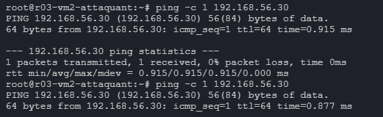
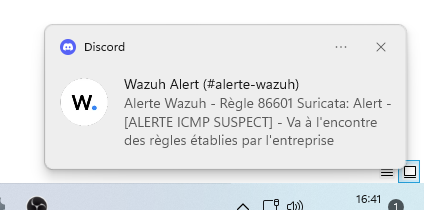
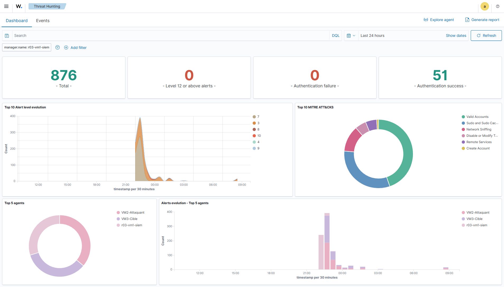
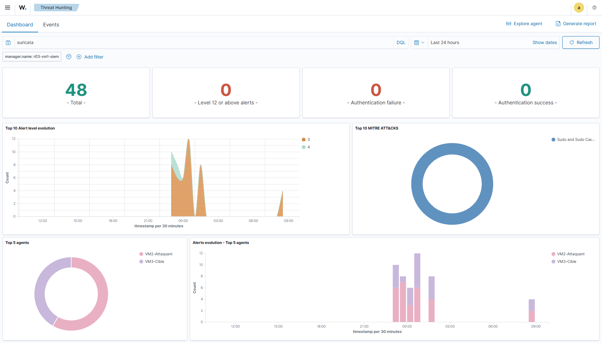
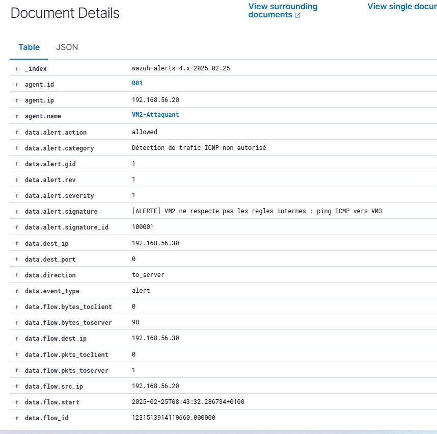
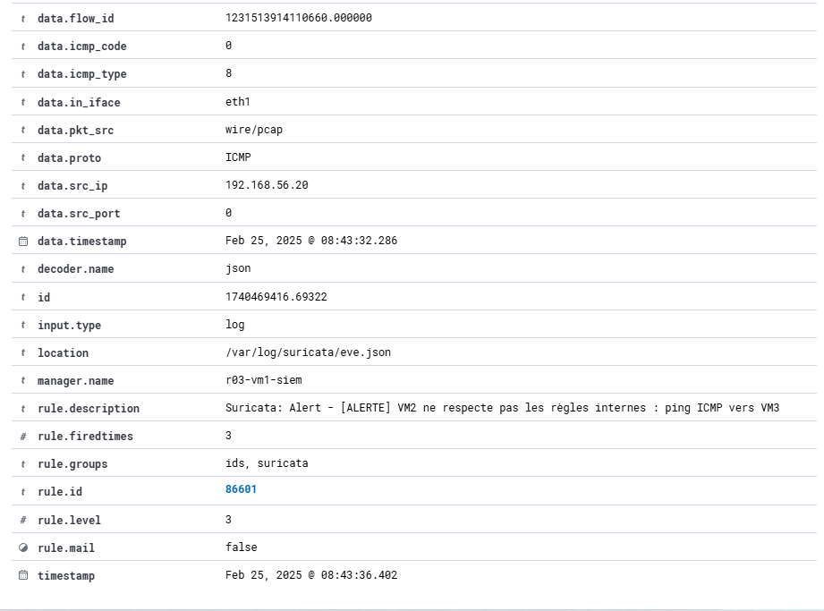
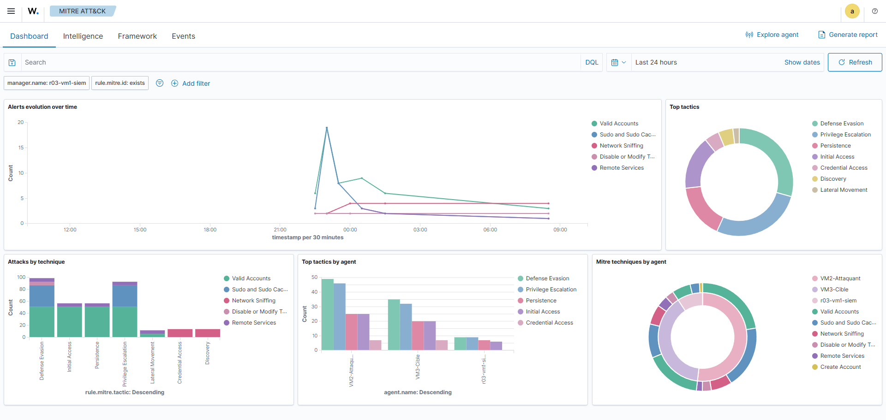
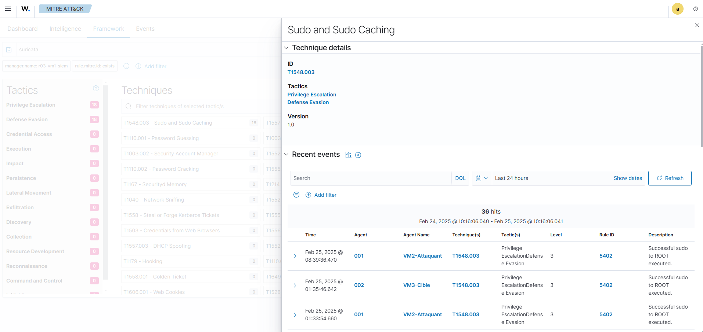

# HomeLab - Annexe 03 - Mise en Œuvre d’un SOC

Ce projet propose la mise en oeuvre d’un **Security Operations Center** (**SOC**) complet dans un environnement virtualisé, **exclusivement à partir d’outils open-source**. Chaque étape (ou homelab) s’appuie sur la précédente, afin d’offrir un apprentissage **progressif** et **opérationnel**. L’accent est mis sur la **pratique**, la **cohérence** et la **structuration** du SOC, du premier outil de surveillance réseau jusqu’à l’intégration des utilisateurs finaux sous Linux ou Windows.

> [!IMPORTANT]INFORMATION IMPORTANTE
> Je vais volontairement anonymiser mes informations à l’écran dans le sens où je ne souhaite en aucun cas divulguer d’information sensible en sachant que ce sera sur mon GitHub et accessible à tous.

---

# Sommaire

- [HomeLab - Annexe 03 - Mise en Œuvre d’un SOC](#homelab---annexe-03---mise-en-œuvre-dun-soc)
- [Sommaire](#sommaire)
- [Chapitre 1 - Partie Gouvernance du SOC](#chapitre-1---partie-gouvernance-du-soc)
  - [I - Introduction](#i---introduction)
  - [II - Objectifs de la gouvernance d'un SOC](#ii---objectifs-de-la-gouvernance-dun-soc)
  - [III - Réflexion sur la mise en place d'un SOC à faible coût](#iii---réflexion-sur-la-mise-en-place-dun-soc-à-faible-coût)
  - [IV - Cadre organisationnel minimaliste du SOC](#iv---cadre-organisationnel-minimaliste-du-soc)
    - [IV-1 - Définition des rôles](#iv-1---définition-des-rôles)
    - [IV-2 - Processus et procédures](#iv-2---processus-et-procédures)
  - [V - Intégration aux standards de sécurité \[ISO 27001\]](#v---intégration-aux-standards-de-sécurité-iso-27001)
  - [VI - Défis et perspectives](#vi---défis-et-perspectives)
  - [VII - Coûts](#vii---coûts)
- [Chapitre 2 - Partie Technique du SOC](#chapitre-2---partie-technique-du-soc)
  - [I - Introduction générale du projet](#i---introduction-générale-du-projet)
  - [II - Problématiques rencontrés](#ii---problématiques-rencontrés)
  - [III - Objectifs](#iii---objectifs)
  - [IV - Prérequis techniques](#iv---prérequis-techniques)
  - [V - Tableau des outils \& concepts](#v---tableau-des-outils--concepts)
    - [A - Que signifient les termes SOC, SIEM, EDR et SOAR ?](#a---que-signifient-les-termes-soc-siem-edr-et-soar-)
    - [B - Quels sont les outils constituant mon SOC minimal](#b---quels-sont-les-outils-constituant-mon-soc-minimal)
    - [C - Quels sont les outils pouvant être inclus pour un socle plus complet](#c---quels-sont-les-outils-pouvant-être-inclus-pour-un-socle-plus-complet)
  - [VI - Structure du dépôt GitHub et organisation du Homelab](#vi---structure-du-dépôt-github-et-organisation-du-homelab)
  - [VII - Mise en situation pratique](#vii---mise-en-situation-pratique)
    - [A - Mise en situation](#a---mise-en-situation)
    - [B - Réalisation des schémas représentant le concept du SOC minimal](#b---réalisation-des-schémas-représentant-le-concept-du-soc-minimal)
      - [1 - Schéma réalisé avec Mermaid](#1---schéma-réalisé-avec-mermaid)
      - [2 - Schéma détaillé créé avec FigJam](#2---schéma-détaillé-créé-avec-figjam)
    - [C - Réalisation du schéma sur la configuration réseau utilisée](#c---réalisation-du-schéma-sur-la-configuration-réseau-utilisée)
  - [VIII - Déploiement des scripts préparés en amont](#viii---déploiement-des-scripts-préparés-en-amont)
    - [A - Scripts utilisés lors de l'installation des VMs](#a---scripts-utilisés-lors-de-linstallation-des-vms)
    - [B - Script de téléchargement de l'assistant d'installation Wazuh pour le SIEM](#b---script-de-téléchargement-de-lassistant-dinstallation-wazuh-pour-le-siem)
  - [IX - Configuration du Vagrantfile](#ix---configuration-du-vagrantfile)
    - [A - Création du fichier de configuration](#a---création-du-fichier-de-configuration)
    - [B - Validation du Vagrantfile](#b---validation-du-vagrantfile)
    - [C - Déploiement de l'Infrastructure](#c---déploiement-de-linfrastructure)
    - [D - Résultat d'un déploiement en une seule commande :](#d---résultat-dun-déploiement-en-une-seule-commande-)
    - [E - Démarrage de la première VM (_SIEM_)](#e---démarrage-de-la-première-vm-siem)
  - [X - Installation de Wazuh sur le SIEM (_VM1_)](#x---installation-de-wazuh-sur-le-siem-vm1)
  - [XI - Exploration de l'Interface d'Administration Wazuh](#xi---exploration-de-linterface-dadministration-wazuh)
    - [A - Accès Initial à l'Interface](#a---accès-initial-à-linterface)
    - [B - Ajout d'un Agent à partir du dashboard de Wazuh.](#b---ajout-dun-agent-à-partir-du-dashboard-de-wazuh)
  - [XII - Mise en place de la solution pour répondre au projet](#xii---mise-en-place-de-la-solution-pour-répondre-au-projet)
    - [A - Configuration du Webhook Discord pour les Notifications](#a---configuration-du-webhook-discord-pour-les-notifications)
    - [B - Configuration du server Wazuh (Détection et Règles)](#b---configuration-du-server-wazuh-détection-et-règles)
      - [**1 - ossec.conf**](#1---ossecconf)
      - [**2. Création des scripts python pour les alertes discord**](#2-création-des-scripts-python-pour-les-alertes-discord)
      - [**3. Modification du fichier `local_rules.xml`**](#3-modification-du-fichier-local_rulesxml)
    - [C - Configuration des Agents Wazuh de Surveillance](#c---configuration-des-agents-wazuh-de-surveillance)
      - [1 - quel est le rôle d'un agent ?](#1---quel-est-le-rôle-dun-agent-)
      - [2 - Installation et configuration de suricata (IDS)](#2---installation-et-configuration-de-suricata-ids)
    - [D - Emulation de l'attaque](#d---emulation-de-lattaque)
      - [1 - Lancement du Ping malveillant](#1---lancement-du-ping-malveillant)
      - [2 - Déclenchement du webhook discord](#2---déclenchement-du-webhook-discord)
      - [3 - Visualisation des données d'alerte dans le dashboard.](#3---visualisation-des-données-dalerte-dans-le-dashboard)
      - [4 - Le Framework Mitre ATT\&CK](#4---le-framework-mitre-attck)
      - [5 - Génération des Rapports](#5---génération-des-rapports)
      - [6 - Création d'un KPI](#6---création-dun-kpi)
  - [XIV - Axes de développement et améliorations envisagées](#xiv---axes-de-développement-et-améliorations-envisagées)
  - [XV - Conclusion](#xv---conclusion)

<br>

---

<br>

# Chapitre 1 - Partie Gouvernance du SOC

Ce chapitre met en lumière l'importance cruciale de la **gouvernance** dans la mise en place d'un SOC. Il examine comment une gouvernance bien structurée permet de **justifier l'investissement**, d'**optimiser les ressources**, et de **maximiser la valeur ajoutée** pour l'organisation.

> À travers une analyse détaillée des aspects stratégiques et opérationnels, je vais démontrer comment un cadre de gouvernance solide, appuyé par des **KPIs** pertinents, peut convaincre les décideurs de l'importance d'adopter et de maintenir un SOC, `même avec des ressources limitées`.

---

## I - Introduction

Dans l'environnement dynamique de la cybersécurité actuelle, l'implémentation d'un **Security Operations Center (SOC)** représente un _investissement stratégique fondamental_ pour assurer une surveillance continue et une gestion efficiente des incidents de sécurité. Néanmoins, les organisations disposant de ressources limitées, indépendamment de leur localisation géographique et de leur mode de fonctionnement, font face à des **contraintes significatives** dans l'établissement d'un SOC :

-   Ressources financières restreintes
-   Cadre normatif de sécurité incomplet
-   Effectifs limités

&nbsp;<center>
<br>
_figure 01 : Comment établir un SOC dans une jeune entreprise ?_

</center>

<br>

---

<br>

## II - Objectifs de la gouvernance d'un SOC

La gouvernance du SOC repose sur plusieurs piliers fondamentaux :

-   **Alignement avec la stratégie de l'entreprise** : _même si l'entreprise génère peu ou pas de revenus, l'objectif est de sécuriser les bases de son développement futur._
-   **Gestion des risques** : _identification des menaces principales et mise en place d'un cadre de gestion minimaliste mais efficace._
-   **Optimisation des ressources** : _l'approche HomeLab permet de démontrer la valeur du SOC sans coût initial._
-   **Sensibilisation et montée en maturité** : _la démonstration du SOC doit convaincre la direction de la nécessité d'investir dans un modèle plus robuste à moyen terme._
-   **Anticiper les coûts** : _il est important de comprendre où se positionnent les coûts dans la conception d'un SOC._

&nbsp;<center>
<br>
_figure 02 : Les piliers d'un SOC_

</center>

<br>

---

<br>

## III - Réflexion sur la mise en place d'un SOC à faible coût

Étant donné les contraintes budgétaires et humaines, un **SOC classique** (internalisé, mutualisé ou externalisé) n'est pas envisageable immédiatement. L'approche que j'ai retenue est la simulation à travers un **HomeLab**, qui remplit plusieurs objectifs :

-   **Tester et valider des outils open-source** (SIEM, IDS) sans investissement majeur, puisqu'il s'agit uniquement d'une démonstration.
-   **Structurer les processus et les responsabilités** pour un éventuel passage à une solution plus formelle ou pour la compléter avec un EDR et un SOAR.
-   **Fournir un argumentaire** à la direction pour démontrer l'intérêt d'un SOC grâce aux rapports générés et aux KPIs sur les temps de détection et de résolution des incidents.

&nbsp;<center>
<br>
_figure 03 : Matrice de positionnement (coût vs efficacité)_

</center>

<br>

---

<br>

## IV - Cadre organisationnel minimaliste du SOC

Cette section présente le **cadre organisationnel minimaliste du SOC** qui se divise en deux parties principales : la **définition des rôles**, qui détaille la répartition des fonctions essentielles comme le `SOC Manager`, `SOC Analyste` et `RSSI` dans une entreprise sans équipe dédiée à la cybersécurité, ainsi que les **processus** et **procédures standardisés** comprenant :

-   la collecte des logs
-   l'analyse des incidents
-   l'escalade et réponse aux incidents
-   les rapports pour l'amélioration continue

### IV-1 - Définition des rôles

Dans une entreprise sans équipe dédiée à la cybersécurité, les fonctions essentielles sont réparties entre plusieurs personnes polyvalentes :

-   **SOC Manager** : _responsable de la coordination du SOC simulé et du reporting à la direction._
-   **SOC Analyste (HomeLab)** : _en charge de la collecte des logs, de la configuration des outils et de l'analyse des menaces._
-   **RSSI (de facto)** : _fonction assumée par un membre de l'équipe impliqué dans la gestion de la sécurité et du projet SOC, sans nomination officielle._

&nbsp;<center>
<br>
_figure 04 : Répartition des Rôles en Cybersécurité dans une Petite Entreprise_

</center>

### IV-2 - Processus et procédures

Le SOC doit maintenir des **processus standardisés**, même dans un environnement simulé :

-   **Collecte des logs et détection des menaces** via un SIEM open-source.
-   **Analyse des incidents** selon un scénario configuré et simulé.
-   **Escalade et réponse aux incidents** : malgré les ressources limitées, une procédure simple de gestion des incidents doit être établie.
-   **Rapports et amélioration continue** : un tableau de bord synthétique permet de suivre les incidents et d'évaluer la progression de la démarche.

&nbsp;<center>
<br>
_figure 05 : Processus standardisés_

</center>

<br>

---

<br>

## V - Intégration aux standards de sécurité [ISO 27001]

L'entreprise n'est pas encore conforme aux exigences de la **normes ISO 27001**, la structuration du SOC doit tout de même s'aligner sur les principes fondamentaux de cette norme :

-   **Gouvernance et responsabilités définies** clairement.
-   **Gestion des risques** fondée sur une approche pragmatique (`identification des vulnérabilités critiques`).
-   **Surveillance et journalisation** pour une détection en temps réel des incidents.
-   **Amélioration continue et retour d'expérience** : malgré des moyens limités, l'objectif est d'établir une **démarche progressive** vers une sécurité renforcée.

&nbsp;<center>
<br>
_figure 06 : Cycle de structuration du SOC_

</center>

> [!CAUTION]
> Dans un **SMSI** (_système de management de la sécurité de l'information_), la mise en place d'un **SOC** est **`INDISPENSABLE`**.

<br>

---

<br>

## VI - Défis et perspectives

-   **Absence de financement** : la démonstration via un HomeLab vise à convaincre la direction d'investir dans le projet.
-   **Travail distanciel compatible** : les outils sélectionnés doivent s'adapter efficacement à une infrastructure distribuée.
-   **Manque de maturité en cybersécurité** : la sensibilisation constitue un levier essentiel pour faciliter une adoption plus large.

Cette approche permet à l'entreprise d'expérimenter un **SOC minimaliste**, d'en évaluer concrètement la valeur et de préparer la transition vers une infrastructure plus robuste.

&nbsp;<center>
<br>
_figure 07 : Matrice sur la Priorisation stratégique des défis SOC_

</center>

## VII - Coûts

> Il faut comprendre que choisir des outils open-source ne coûtera financièrement rien. Là où sa se complique c'est sur le `coût humain`.

En effet la plus part des attaques sont réalisé la nuit et généralement le week-end quand personne n'est au travail.
Ainsi, la problématique rencontré est simple :

-   Est-ce réellement viable d'investir dans :
    -   **8/5** : 8h sur 5 jours hors week-end
    -   **24/7** : 24h sur 7 jours

Le choix est important selon le degré des ressources confidentiels qui sont à surveiller.
A mon sens le 8/5 est une hérésie mais il est évident que le porte monnaie joue aussi un rôle fondamentale dans le choix de ce dernier.

<br>

# Chapitre 2 - Partie Technique du SOC

## I - Introduction générale du projet

Ce projet **R03-SOC** vise à mettre en œuvre un **environnement de cybersécurité** fonctionnel basé exclusivement sur des **outils open-source**, adapté aux entreprises disposant de ressources financières limitées.

Les seuls coûts à prévoir sont ceux liés à l'hébergement et aux ressources humaines nécessaires à la gestion des différents composants.

Les objectifs d'apprentissage sont :

-   **Déployer** pas à pas les composants `open-source` d'un SOC.
-   **Simuler** un scénario réel de surveillance et de réponse aux incidents.
-   **Comprendre** le rôle précis de chaque brique (`IDS`, `SIEM`) et leurs interactions.

Face à l'évolution constante des **menaces informatiques**, la mise en place d'un **SOC** (_Security Operations Center_) est essentielle pour assurer la **détection**, la **surveillance** et la **réponse aux incidents de sécurité**.

<br>

## II - Problématiques rencontrés

> [!NOTE]NOTE
> Ma problématique découle d'un manque de connaissances pratiques. Le cours théorique reçu dans mon centre de formation était trop bref pour permettre une mise en application directe sans recherches personnelles approfondies.

**Mes questions principales étaient** :

-   Où se positionne le SOC dans la gouvernance ?
-   Comment construire un **SOC complet** à l'aide de **logiciels open-source** ?
    -   couvrant la détection réseau
    -   la corrélation d'événements
    -   l'analyse forensique
    -   la gestion d'incidents ?

Tout en **optimisant la courbe d'apprentissage**, avec comme seules ressources :

-   une bonne connexion internet
-   une **recherche personnelle** approfondie
-   une première expérience en virtualisation permettant d'utiliser et d'optimiser mon ordinateur personnel.
-   les échanges avec les camarades de ma promotion.

> [!WARNING]ATTENTION
> Lors de mes tests, j'ai rencontré des problématiques majeurs lié aux droits. Pour les résoudre, j'ai dû modifier les commandes officielles en incluant **sudo**.

<br>

## III - Objectifs

-   **Objectif principal** : Concevoir et déployer pas à pas une infrastructure SOC simulée, en utilisant exclusivement des solutions et outils `open-source` reconnus et libres d'utilisation.

-   **Objectifs secondaires** :
    1. **Assimiler** les composants essentiels d'un SOC minimal.
    2. **Découvrir** les fondamentaux du SIEM (`Wazuh-indexer`,`Wazuh-server`,`Wazuh-dashboard`).
    3. **Comprendre** l'importance d'implémenter l'**IDS**(_Intrusion Detection System_) `Suricata` dans chacun des agents (`Wazuh agent`) installés sur des machines virutelles spécifiques.
    4. **Réaliser** l'importance de chaque composant dans le processus de **détection** et de **réponse**.
    5. **Établir** une **feuille de route** reliant logiquement tous les composants (`collecte`, `analyse`, `corrélation`, `réaction`).

Ce projet répond principalement au besoin **technique** de l'`annexe R03`, me permettant d'acquérir **une première expérience concrète** dans le déploiement et la gestion d'un SOC moderne, exclusivement basé sur des **outils open-source**. Chaque composant a été soigneusement sélectionné et documenté pour optimiser mon apprentissage, tout en respectant les standards de l'industrie (_selon mes recherches_).

<br>

---

<br>

## IV - Prérequis techniques

Pour garantir la réussite de ce projet, il est nécessaire d'avoir certains prérequis techniques et opérationnels.

-   **Compétences Techniques Requises**

    -   Maîtrise des systèmes d'exploitation (`Linux` / `Windows`).
    -   Compréhension des protocoles réseau (`TCP/IP`, `routage`).

    &nbsp;

-   **Infrastructure Technique**

    -   Plateforme de virtualisation : **Vagrant** et **VirtualBox** opérationnels
    -   Système de versioning : **Git** pour la gestion du code source.
    -   **Configuration Matérielles** :

        -   **Mémoire vive (RAM)** : `32 GO`
        -   **Système d'exploitation (OS)** : `Windows 11`
        -   **CPU** : `Intel(R) Core(TM) i5-10600KF CPU @ 4.10GHz`

&nbsp;

-   **Connectivité**

    -   Un accès internet stable m'est indispensable pour télécharger les dépendances et maintenir l'environnement à jour.
    -   J'utilise le réseau **BRIDGE**.

**Pourquoi BRIDGE ?**<br>

Cette configuration réseau permet la communication entre toutes les machines virtuelles (VM) déployées et le système hôte. Dans mon cas, avec Windows 11 comme hôte, cela évite le déploiement d'une machine virtuelle Windows supplémentaire.

**Pourquoi ne pas utiliser le réseau NAT ?**<br>

Le réseau NAT, bien qu'il fournisse un accès internet aux machines virtuelles, ne permet pas la communication entre elles.

> [!IMPORTANT] INFORMATION<br>
> Pour ce projet, j'utilise une image **Ubuntu 22.04** optimisée fournie par `Bento`, reconnue pour ses distributions allégées et performantes. Bien que cette version ne soit pas la plus récente, elle offre un excellent compromis entre performance et consommation des ressources, permettant une mise en production efficace. Je configure l'environnement en français via un script automatisé lors du déploiement de chaque machine virtuelle (VM).

<br>

---

<br>

## V - Tableau des outils & concepts

### A - Que signifient les termes SOC, SIEM, EDR et SOAR ?

| **Sigle**  | **Explication**                                    | **Description**                                                                                           | **Rôle**                                                                                             |
| ---------- | -------------------------------------------------- | --------------------------------------------------------------------------------------------------------- | ---------------------------------------------------------------------------------------------------- |
| **`SOC`**  | _Security Operations Center_                       | Surveillance et réponse en continu aux incidents de sécurité.                                             | Supervision en temps réel, coordination et réponse aux attaques.                                     |
| **`SIEM`** | _Security Information and Event Management_        | Collecte, analyse et corrèle les événements de sécurité pour détecter les menaces (Wazuh en fait partie). | Centralisation et corrélation des logs pour la détection des incidents.                              |
| **`EDR`**  | _Endpoint Detection and Response_                  | Détection et réponse aux menaces spécifiques aux endpoints.                                               | Surveillance avancée des endpoints avec réponse automatisée aux menaces.                             |
| **`SOAR`** | _Security Orchestration, Automation, and Response_ | Automatise la réponse aux incidents en orchestrant les actions entre différents outils.                   | Réduction du temps de réponse aux menaces par automatisation et coordination des outils de sécurité. |

### B - Quels sont les outils constituant mon SOC minimal

| **Outil**          | **Catégorie**                                    | **Description**                                                                                                                                                                | **Rôle**                                                                                           | **Utilisé** |
| ------------------ | ------------------------------------------------ | ------------------------------------------------------------------------------------------------------------------------------------------------------------------------------ | -------------------------------------------------------------------------------------------------- | ----------- |
| **`Wazuh`**        | Surveillance des endpoints _(SIEM)_              | Collecte et corrèle les logs des hôtes, détecte les intrusions et surveille le système. Filebeat collecte les logs, Wazuh Indexer les stocke et Wazuh Dashboard les visualise. | Protection des endpoints, détection de comportements suspects, centralisation et analyse des logs. | ✅          |
| **`Suricata`**     | Système de Détection d'Intrusion _(IDS/IPS)_     | Analyse le trafic réseau pour détecter des menaces via des règles et signatures.                                                                                               | Détection des menaces en analysant le trafic réseau.                                               | ✅          |
| **`MITRE ATT&CK`** | Cadre des tactiques et techniques des attaquants | Base de données des techniques d’attaques, intégrée à Wazuh.                                                                                                                   | Référence pour comprendre et classifier les menaces détectées.                                     | ✅          |

### C - Quels sont les outils pouvant être inclus pour un socle plus complet

| **Outil**          | **Catégorie**                              | **Description**                                                                                                                                                   | **Rôle**                                                                                                                                                    |
| ------------------ | ------------------------------------------ | ----------------------------------------------------------------------------------------------------------------------------------------------------------------- | ----------------------------------------------------------------------------------------------------------------------------------------------------------- |
| **`Snort`**        | Système de Prévention d'Intrusion _(IPS)_  | Snort surveille le trafic réseau et peut bloquer les activités malveillantes.<br>Similaire à Suricata, mais focalisé sur la prévention et le blocage automatique. | Prévention des menaces en bloquant les activités malveillantes en temps réel.                                                                               |
| **`Zeek`**         | Surveillance du réseau                     | Zeek analyse les paquets réseau ( trafic ) pour détecter des comportements suspects.<br>( anomalies ou des activités malveillantes ).                             | Surveille en temps réel le réseau, génère des logs détaillés.                                                                                               |
| **`Velociraptor`** | Investigation forensique                   | Velociraptor collecte et analyse des données forensiques sur les endpoints. Permet l’examen rapide d’artefacts système (fichiers, mémoire, événements).           | Investigation forensique pour comprendre les incidents de sécurité. Approfondit l’analyse post-incident et recueille des preuves tangibles.                 |
| **`OpenCTI`**      | Gestion des renseignements sur les menaces | OpenCTI centralise les renseignements sur les menaces pour une meilleure réponse aux incidents. (feeds externes, IoC).                                            | Centralisation et partage des renseignements sur les menaces. Ce qui améliore la connaissance des tactiques et techniques adverses pour adapter la défense. |
| **`TheHive`**      | Gestion des incidents                      | Plateforme collaborative pour suivre et coordonner la gestion des incidents de sécurité.                                                                          | Permet la gestion et l’analyse des incidents avec traçabilité.                                                                                              |
| **`Cortex`**       | Automatisation des analyses                | Automatise les tâches d’enquête avec des analyses (hash, scans, etc.). Intégré avec TheHive.                                                                      | Automatisation des investigations pour accélérer la réponse aux incidents.                                                                                  |

<br>

---

<br>

## VI - Structure du dépôt GitHub et organisation du Homelab

Pour faciliter la compréhension et l'évolutivité de ce HomeLab, j'ai créé différents scripts :

-   **`configure_vm.sh`** : _permet d'effectuer une configuration automatique initiale lors de l'installation de la machine virtuelle._
-   **`configure_locale_fr.sh`** : _permet de configurer le système en langue française._
-   **`full_system_update.sh`** : _permet d'effectuer une maintenance globale du système avant un snapshot._
-   **`install_oh_my_zsh`** : _permet de remplacer bash par un shell plus personnalisable et élégant (touche geek).._
-   **`install_outils_x`** : _permet d'installer un outil spécifique, où **x** représente le nom de l'outil (`wazuh`, `snort`, `suricata`, etc.)._

> [!WARNING]ATTENTION
> La structure de cette partie est encore en cours de réflexion, avec pour objectif de simplifier l'organisation tout en préservant l'aspect ludique du projet.

L'arborescence actuelle est la suivante : (_elle pourra évoluer selon les besoins_)

```
R03-SOC/
│
├── README.md                       # Documentation principale
├── .gitignore                      # Fichiers à ignorer
├── Vagrantfile                     # Configuration des VMs
├── images/                         # Images et captures
├── schema/                         # Schéma mermaid
├── shared/                         # Fichiers partagés entre les VMs
│   ├── config/
│   │   ├── configure_locale_fr.sh  # Script pour le passage au Français
│   │   ├── configure_vm.sh         # Script pour configurer les VMs
│   ├── scripts/
│   │   ├── install_oh_my_zsh.sh    # Installe ZSH puis OH MY ZSH
│   │   ├── install_snort.sh        # Installe SNORT
│   │   ├── install_suricata.sh     # Installe SURICATA
│   │   ├── install_wazuh.sh        # Télécharge l'assistant WAZUH
└── └── └── ...
```

<br>

---

<br>

## VII - Mise en situation pratique

### A - Mise en situation

La société X dispose d'un petit parc informatique constitué de 3 postes informatiques :

-   `client n°1 windows 11` _Hôte du HomeLab afin de gagner en ressource_
-   `client n°2 Ubuntu 22.04` _(Qui sera considéré comme l'attaquant)_
-   `Server Ubuntu 22.04` _(Considéré comme la cible)_

Pour des raisons qui leurs appartienent, une désision forte à été prise pour éviter toute attaque. Il s'agit simplement **d'interdir toute tentative de ping vers les machines du réseau**.

Dans le cadre de cette initiative, nous avons implémenté un **SOC** pour répondre aux exigences de sécurité. L'infrastructure comprend un `serveur dédié hébergeant une solution SIEM`. Cette solution centralisera la collecte des journaux d'événements via un agent déployé. L'agent sera configuré pour transmettre les données formatées vers le gestionnaire central (_server-wazuh qui **n'existe pas encore**_).

> [!NOTE]NOTE
> En cas de détection d'une requête **PING** (_ICMP_), le système générera immédiatement une notification d'alerte qui sera transmise au canal dédié `alerte-wazuh` sur la plateforme **Discord** sécurisée.

L'objectif est de traiter rapidement l'information tout en conservant une traçabilité pour prouver toute tentative malveillante des utilisateurs.

**`Ainsi le périmètre est définit sur le trafic interne du réseau.`**

### B - Réalisation des schémas représentant le concept du SOC minimal

#### 1 - Schéma réalisé avec Mermaid

&nbsp;<center>
<br>
_figure 08 : Schéma du HomeLab avec Mermaid_

</center>

#### 2 - Schéma détaillé créé avec FigJam

&nbsp;<center>
<br>
_figure 09 : Schéma du HomeLab créé avec FigJam_

</center>

### C - Réalisation du schéma sur la configuration réseau utilisée

&nbsp;<center>
<br>
_figure 10 : Schéma de la configuration réseau utilisée_

</center>

<br>

---

<br>

## VIII - Déploiement des scripts préparés en amont

### A - Scripts utilisés lors de l'installation des VMs

Liste des fichiers déployés dans le répertoire `server/config/`

-   **`configure_vm.sh`** : _Permet d'installer Postfix et d'éviter que l'installation ne plante._
-   **`configure_locale_fr.sh`** : _Comme expliqué précédemment, ce script permet de passer le système en français._

Ces fichiers sont indispensable pour le Vagrantfile.
Les autres scripts sont a utiliser si besoin.

### B - Script de téléchargement de l'assistant d'installation Wazuh pour le SIEM

Dans la première VM (**SIEM**), le Vagrantfile nécessite un script pour télécharger l'assistant Wazuh (**wazuh-install.sh**). Ce script a été déployé dans le répertoire `server/config/`

-   **`install_wazuh.sh`** : _Permet de télécharger l'assistant d'installation de Wazuh._

<br>

---

<br>

## IX - Configuration du Vagrantfile

La mise en place du Vagrantfile constitue une étape essentielle dans l'établissement de mon laboratoire. Ce fichier de configuration définit l'architecture complète de l'infrastructure virtualisée.

### A - Création du fichier de configuration

```rb
# -*- mode: ruby -*-
# vi: set ft=ruby :

# Définition des variables d'environnement
def get_first_bridge_interface
  # Obtenir la liste des interfaces
  bridges = `VBoxManage list bridgedifs`
  # Trouver la première interface qui n'est pas Hyper-V
  bridges.split("\n").each do |line|
    if line.start_with?("Name:") && !line.include?("Hyper-V")
      return line.split(":")[1].strip.gsub('"', '')
    end
  end
  nil
end

# Permet d'éviter toute intéraction avec l'utilisateur
# dans le choix de l'interface réseau
BRIDGE_INTERFACE = get_first_bridge_interface()

# Définition du mode réseau (privé recommandé)
NETWORK_MODE = "private_network" # Peut être "public_network" si nécessaire

# Configuration des VMs
NODES = {
  'vm1' => {
    hostname: 'r03-vm1-siem',
    ip_public: '10.0.2.10',
    ip_private: '192.168.56.10',
    promiscuous_mode: 'allow-all',
    memory: 8192,
    cpus: 4,
    scripts: ['wazuh-411']
  },
  'vm2' => {
    hostname: 'r03-vm2-attaquant',
    ip_public: '10.0.2.20',
    ip_private: '192.168.56.20',
    promiscuous_mode: 'allow-all',
    memory: 2048,
    cpus: 2,
    scripts: []
  },
  'vm3' => {
    hostname: 'r03-vm3-cible',
    ip_public: '10.0.2.30',
    ip_private: '192.168.56.30',
    promiscuous_mode: 'allow-all',
    memory: 2048,
    cpus: 2,
    scripts: []
  }
}

Vagrant.configure("2") do |config|

  NODES.each do |node_name, node_config|
    config.vm.define node_name do |node|

      # Configuration de base
      node.vm.box = "bento/ubuntu-22.04"
      node.vm.hostname = node_config[:hostname]

      # Configuration du provider VirtualBox
      node.vm.provider "virtualbox" do |vb|
        vb.name = "Homelab-vagrant-[R03]-[#{node_name}]"
        vb.memory = node_config[:memory]
        vb.cpus = node_config[:cpus]
      end

      # Configuration réseau (privé recommandé)
      if NETWORK_MODE == "public_network"
        node.vm.network "public_network",
          ip: node_config[:ip_public],
          bridge: BRIDGE_INTERFACE,
          auto_config: true
      else
        node.vm.network "private_network",
          ip: node_config[:ip_private],
          promiscuous_mode: node_config[:promiscuous_mode],
          auto_config: true
      end

      # Dossier partagé
      node.vm.synced_folder "shared", "/home/vagrant/shared"

      # Scripts de provisioning communs
      node.vm.provision "shell", path: "server/config/configure_locale_fr.sh"
      node.vm.provision "shell", path: "server/config/configure_vm.sh"

      # Scripts spécifiques pour installer ou télécharger des outils
      node_config[:scripts].each do |script|
        node.vm.provision "shell", path: "shared/scripts/install_#{script}.sh"
      end
    end
  end

end

```

### B - Validation du Vagrantfile

```bash
# Pour valider la configuration du Vagrantfile, je dois exécute la commande :
vagrant validate # La réponse attendue est "Vagrantfile validated successfully."
```

### C - Déploiement de l'Infrastructure

Deux méthodes de déploiement sont disponibles (_la première étant recommandée_) :

```bash
# Option 1 - Déploiement complet de l'infrastructure
vagrant up

# Option 2 - Déploiement sélectif par machine virtuelle
vagrant up <nom_vm> # Exemple : vm1, vm2, ou vm3
```

**Gestion des Incidents de parcours**

```bash
# Arrêt de l'ensemble des machines virtuelles
vagrant halt

# Arrêt ciblé d'une machine virtuelle spécifique
vagrant halt <nom_vm>
```

**Supprimer les VMs (Nettoyage de l'Environnement)**

```bash
# Suppression complète de l'infrastructure
vagrant destroy -f

# Suppression d'une machine virtuelle spécifique
vagrant destroy -f <nom_vm>
```

### D - Résultat d'un déploiement en une seule commande :

&nbsp;<center>
<br>
_figure 11 : Détection initiale des trois machines virtuelles et début du déploiement de VM1_

</center>

<br>

&nbsp;<center>
<br>
_figure 12 : Mise en œuvre de la configuration en langue française sur VM1_

</center>

<br>

&nbsp;<center>
<br>
_figure 13 : Processus d'installation ultérieur de Postfix_

</center>

<br>

&nbsp;<center>
<br>
_figure 14 : Achèvement réussi de la configuration de VM1 et transition vers le déploiement de VM2_

</center>

<br>

&nbsp;<center>
<br>
_figure 15 : Achèvement du déploiement de VM2 et initiation de la configuration de VM3_

</center>

<br>

> [!CAUTION]**SÉCURITÉ IMPORTANTE**<br>
> Le script d'installation de Wazuh n'a pas été exécuté automatiquement après l'installation de Postfix sur VM2. Cette approche a été adoptée car **les informations d'identification sont affichées en clair lors de l'installation**. Pour garantir la `confidentialité des données sensibles`, le déploiement sera effectué manuellement.

<br>

&nbsp;<center>
<br>
_figure 16 : Déploiement de VM3 terminé avec succès sans erreurs signalées_

</center>

Les trois machines virtuelles ont été provisionnées (déployées) avec succès et sont maintenant accessibles dans VirtualBox.

<br>

> [!IMPORTANT]IMPORTANT
> Les machines virtuelles ne seront pas lancées depuis l'interface de VirtualBox.

<br>

&nbsp;<center>
<br>
_figure 17 : Affichage de l'état actuel des machines virtuelles actives dans VirtualBox_

</center>

### E - Démarrage de la première VM (_SIEM_)

Pour procéder à la configuration initiale de la machine virtuelle SIEM, je dois établir une connexion SSH et effectuer une série de vérifications systématiques. La connexion s'établit via la commande suivante :

```bash
# Établir une connexion SSH vers vm1 (Le SIEM)
vagrant ssh vm1
```

**Liste des vérifications à effectuer :** (_Si cocher c'est que c'est validé_) :

-   [x] Exécuter la mise à jour des paquets système
-   [x] Procéder à la mise à niveau complète des composants
-   [x] Effectuer le nettoyage des paquets obsolètes

    ```bash
    # Commande unifiée pour les opérations de maintenance
    sudo apt update -y && sudo apt full-upgrade -y && sudo apt autoremove -y
    ```

-   [x] Vérifier la disponibilité du script **`wazuh-install.sh`**
    ```bash
    # Vérification des fichiers présents
    ls # doit afficher : shared (répertoire) et le script "wazuh-install.sh"
    ```
-   [x] Valider la configuration réseau (adresse IP attendue : `192.168.56.10`)
    ```bash
    # Affichage de la configuration réseau
    ip a
    ```
-   [x] Tester la connectivité avec VM2 (`192.168.56.20`)
    ```bash
    # Test de connectivité vers VM2 en définissant un nombre de paquet avec l'option -c ici 1
    ping 192.168.56.20 -c 1
    ```
-   [x] Tester la connectivité avec VM3 (`192.168.56.30`)
    ```bash
    # Test de connectivité vers VM2 en définissant un nombre de paquet avec l'option -c ici 2
    ping 192.168.56.30 -c 2
    ```

<br>

## X - Installation de Wazuh sur le SIEM (_VM1_)

Suite à la validation réussie des vérifications préliminaires, je peux procéder à l'installation du système.
L'installation s'effectue via l'exécution du script de déploiement préconfiguré qui a été téléchargé.

> [!NOTE]NOTE IMPORTANTE
> Le processus d'installation nécessite un temps de traitement conséquent.
> Des périodes d'inactivité apparente sont normales durant cette phase.
> Il est recommandé de laisser le processus se terminer sans interruption.

```bash
# Exécution du script "wazuh-install.sh" :
sudo bash wazuh-install.sh -a
# l'option -a correspond à l'installation automatique
```

<br>

> [!IMPORTANT]IMPORTANT
> Comme évoqué en amont, `les informations d'authentification pour le tableau de bord Wazuh` seront fournies à la finalisation de l'installation. Ces données devront être intégrées dans le fichier `.env` à la racine de ce projet. L'idée n'est pas de réutiliser les variables mais d'avoir une trace en cas de besoin immédiat.

**Configuration du fichier .env** :

<br>

```perl
# Identifiant pour Wazuh Dashboard
WAZUH_DASBOARD_USER=""
WAZUH_DASBOARD_PASSWORD=""
```

&nbsp;<center>
<br>
_figure 18 : Installation automatique de wazuh en cours_

</center>

<br>

> [!WARNING] REMARQUE COMPLÉMENTAIRE
> En raison de la durée significative de cette installation, il est conseillé d'optimiser le temps en établissant des connexions SSH parallèles vers VM2 et VM3> via la commande **`vagrant ssh vm2`** et **`vagrant ssh vm3`** dans un terminal distincts. Ensuite, je procèderais sur chacune d'elles à la mise à jour des systèmes avec la commande suivante :

<br>

```bash
# Mise à jour complète des paquets et dépendances déjà présents sur le système.
sudo apt update -y && sudo apt full-upgrade -y && sudo apt autoremove -y
```

**Configuration finale sur VM1 (SIEM)**

Une fois l'installation de Wazuh terminé sur le server, alors il faut empêcher les mises à niveau pour éviter de casser la compatibilité.

```bash
# Configuration critique pour la stabilité du système
# Prévention des mises à jour automatiques pour maintenir la compatibilité des services
sudo sed -i "s/^deb /#deb /" /etc/apt/sources.list.d/wazuh.list
sudo apt update -y
```

<br>

---

<br>

## XI - Exploration de l'Interface d'Administration Wazuh

### A - Accès Initial à l'Interface

Pour accéder à l'interface d'administration, je me rends sur la pagee [https://192.168.56.10](https://192.168.56.10) dans mon navigateur.

&nbsp;<center>
<br>
_figure 19 : Page d'authentification de l'interface d'administration Wazuh_

</center>

<br>

&nbsp;<center>
<br>
_figure 20 : Vue d'ensemble du tableau de bord Wazuh après une installation réussie_

</center>

<br>

### B - Ajout d'un Agent à partir du dashboard de Wazuh.

&nbsp;<center>
<br>
_figure 21 : ajout d'un nouvel agent_

</center>

<br>

**Pour configurer un agent dans Wazuh, les éléments suivants sont requis :**

1.  Je sélectionne le système d'exploitation désiré
2.  Je saisie l'adresse IP du serveur où Wazuh Manager est installé (VM1 - 192.168.56.10 dans mons cas)
3.  Je saisis le nom de l'agent que je souhaite afin de les dinstinguer et je sélectionne son groupe si il en a un sinom il sera dans le groupe par défaut
4.  **`Je copie la commande et je la colle dans chacun des terminaux ouvert, là où je veux installé un agent. (VM2 et VM3)`**
5.  Je relance saisie les commandes qui me sont fournis sur chacune des VMs où l'agent à été déployé.

**Configuration d'un agent Wazuh - Procédure détaillée**

-   **Étape 1** : _Sélection du système d'exploitation correspondant à l'agent à déployer._
-   **Étape 2** : _Configuration l'adresse IP du serveur Wazuh Manager (VM1 - 192.168.56.10)._
-   **Étape 3** : _Identification de l'agent en définissant un nom d'agent distinctif et j'assigne l'agent à un groupe spécifique (ou laisser dans le groupe par défaut)_
-   **Étape 4** : _Déploiement de l'agent en Copient la commande d'installation générée et en l'exécutant sur les machines cibles (VM2 et VM3)._
-   **Étape 5** : _J'exécute les commandes d'activation fournies sur chaque machine où l'agent a été déployé._

&nbsp;<center>
<br>
_figure 22 : section dédiée à l'intégration d'un nouvel agent dans l'environnement Wazuh (illustration avec la VM2)_

</center>

<br>

&nbsp;<center>
<br>
_figure 23 : Vérification du statut de connexion dans l'interface Wazuh (Dashbord)._

</center>

<br>

---

<br>

## XII - Mise en place de la solution pour répondre au projet

### A - Configuration du Webhook Discord pour les Notifications

Dans cette section, je détaille l'intégration d'un webhook Discord pour les futures transmissions sécurisées des alertes.
L'objectif est de configurer un canal de notification automatisé pour la détection d'activités ICMP suspectes.

La configuration s'effectue dans l'interface d'administration Discord via le chemin suivant :
`Paramètres du serveur` > `Intégrations` > `Webhooks`

**Procédure de configuration :**

-   Création d'un nouveau webhook via le bouton dédié
-   Attribution d'un nom approprié
-   Sélection du canal **privé** de destination qui aura été préconfiguré

Une fois la configuration terminée, l'URL du webhook doit être extraite et intégrée au fichier `.env` du projet pour assurer la persistance de la configuration. Il s'agit d'ajouter une nouvelle ligne au fichier existant soit :

```perl
# Identifiant pour le Wazuh Dashboard
WAZUH_DASBOARD_USER=""
WAZUH_DASBOARD_PASSWORD=""

# Webhook du discord privé contenant le channel nécessaire aux alertes
WEBHOOK_DISCORD_URL=""
```

### B - Configuration du server Wazuh (Détection et Règles)

Cette section détaille la configuration des règles Suricata, un **IDS** (_Intrusion Detection System_). Suricata sera déployé sur chaque VM disposant d'un agent pour assurer une surveillance réseau complète.

> [!NOTE] NOTE
> Pour permettre la modification des fichiers qui suivent, il faut savoir que cette partie est limité pour l'utiliser en tant qu'utilisateur **Vagrant**. j'aurais besoin d'élever mes privilèges le temps de la configuration. Je passe donc en **root** avec la commande ci-dessous.

```bash
# Passage en mode root
sudo -i
```

#### **1 - ossec.conf**

Le fichier principal de configuration **ossec.conf** se trouve dans le répertoire `/var/ossec/etc/`.

> [!IMPORTANT] Information
> La configuration du webhook doit être ajoutée à la fin du fichier en respectant la structure XML et le bloc doit-être impérativement entre les balises `<ossec_config>` et `<ossec_config>`.

```xml
  <!--
    R03 Intégration d'un webhook discord pour émettre
    une alerte en cas d'une détection d'une règle Suricata
  -->
  <integration>
    <name>r03-discord</name>
    <hook_url>https://discord.com/api/webhooks/<ID>/<TOKEN></hook_url>
    <level>3</level>
    <group>suricata,sysmon</group>
    <alert_format>json</alert_format>
    <rule_id>0</rule_id>
  </integration>
```

**Explicatioon du la configuration ci-dessus :**

1. Le nom du script Python qui gère l'envoi des alertes vers Discord. (`r03-discord`)
2. L'URL du webhook Discord pour l'intégration des alertes. (`doit être modifié ici`)
3. Le seuil minimal de détection des événements. (`3`)
4. Les groupes de surveillance concernés. (`suricata,sysmon`)
5. Le format de la structure des alertes. (`json`)
6. Le paramètre rule_id défini à 0 pour surveiller toutes les alertes Suricata.

#### **2. Création des scripts python pour les alertes discord**

Officiellement il n'existe pas encore de script spécifique pour Discord. Pour solutionner ça j'ai modifier un script Python pour permettre d'afficher une alerte sympatique qui sera visible dans les testes à la fin. Chacun des scripts sont situés dans le répertoire `/var/ossec/integrations`.

> [!NOTE] Note
> **Le premier script permet de lancer le script python. Son contenu sera identique à celui qui s'appel `slack`. Ainsi je vais duppliquer celui-ci en le renommant `r03-discord`.**

```bash
# Copie du fichier en le renommant r03-discord
cp /var/ossec/integrations/slack /var/ossec/integrations/r03-discord
```

Création du script python portant le même nom (`r03-discord.py`) qui correspond à la mise en forme de l'alerte qui sera généré sur discord.

```bash
# Utilisation de l'éditeur de texte nano pour la création du fichier r03-discord.py
nano /var/ossec/etc/integrations/r03-discord.py
```

**Contenu du fichier `r03-discord.py` :**

```python
import json
import os
import sys
import requests
from datetime import datetime

# Codes d'erreur
ERR_NO_REQUEST_MODULE = 1
ERR_BAD_ARGUMENTS = 2
ERR_FILE_NOT_FOUND = 6
ERR_INVALID_JSON = 7

# Configuration du chemin
pwd = os.path.dirname(os.path.dirname(os.path.realpath(__file__)))
LOG_FILE = f'{pwd}/logs/integrations.log'

# Indices pour les arguments
ALERT_INDEX = 1
WEBHOOK_INDEX = 3


def generate_msg(alert: dict, options: dict = None) -> str:
    """
    Génère le message d'alerte formaté pour Discord.
    """
    # Définition des couleurs selon le niveau d'alerte
    # level = alert['rule']['level']
    # if level <= 4:
    #     color = 3066993  # Vert
    # elif 5 <= level <= 12:
    #     color = 16776960  # Jaune
    # else:
    #     color = 15158332  # Rouge

    # Récupération des informations de l'agent
    agent_name = alert.get('agent', {}).get('name', 'agentless')
    agent_ip = alert.get('agent', {}).get('ip', 'N/A')
    signature_id = alert.get('data', {}).get('alert', {}).get('signature_id', 'N/A')


    # Construction du payload pour Discord
    payload = {
        "username": "Wazuh Alert",
        "avatar_url": "https://wazuh.com/uploads/2024/06/multi-site-implementation-logo.webp",
        "embeds": [{
            "title": f"Alerte Wazuh - Règle {alert['rule']['id']}",
            "description": alert['rule']['description'],
            "color": 15158332,
            "fields": [
                {
                    "name": f"{agent_name}",
                    "value": agent_ip,
                    "inline": True
                },
                {
                    "name": "Signature ID",
                    "value": signature_id,
                    "inline": True
                },
                {
                    "name": "Niveau d'alerte suricata",
                    "value": alert['data']['alert']['severity'],
                    "inline": True
                }
            ],
            "footer": {
                "text": f"Détecté le {datetime.now().strftime('%d-%m-%Y')} à {datetime.now().strftime('%H:%M:%S')} | Localisation: {alert.get('location', 'N/A')}"
            }
        }]
    }

    debug(f"Payload généré: {json.dumps(payload, indent=2)}")
    return json.dumps(payload)

def send_msg(msg: str, webhook_url: str) -> None:
    """
    Envoie le message au webhook Discord.
    """
    headers = {'content-type': 'application/json'}
    try:
        debug(f"Tentative d'envoi vers {webhook_url}")
        response = requests.post(webhook_url, data=msg, headers=headers, timeout=10)
        response.raise_for_status()
        debug(f"Message envoyé avec succès. Status: {response.status_code}")
        # Log de la réponse complète pour le débogage
        debug(f"Réponse complète: {response.text}")
    except requests.exceptions.RequestException as e:
        debug(f"Erreur lors de l'envoi du message: {str(e)}")
        raise


def debug(msg: str) -> None:
    """
    Enregistre les messages de debug dans le fichier de log.
    """
    timestamp = datetime.now().strftime("%Y-%m-%d %H:%M:%S")
    log_message = f"[{timestamp}] {msg}"

    print(log_message)
    with open(LOG_FILE, 'a') as f:
        f.write(log_message + '\n')


def main(args):
    debug("Démarrage du script Discord")
    debug(f"Arguments reçus: {args}")

    if len(args) < 4:
        debug("Arguments insuffisants")
        sys.exit(ERR_BAD_ARGUMENTS)

    alert_file = args[ALERT_INDEX]
    webhook_url = args[WEBHOOK_INDEX]

    debug(f"Fichier d'alerte: {alert_file}")
    debug(f"Webhook URL: {webhook_url}")

    try:
        with open(alert_file) as f:
            alert_data = json.load(f)
            debug("Alerte chargée avec succès")
    except Exception as e:
        debug(f"Erreur lors de la lecture du fichier d'alerte: {str(e)}")
        sys.exit(ERR_FILE_NOT_FOUND)

    msg = generate_msg(alert_data)
    send_msg(msg, webhook_url)


if __name__ == "__main__":
    main(sys.argv)
```

> [!IMPORTANT] Information
> Il est important de changer les droits d'utilisation pour ces deux fichiers.

```bash
# Modification des droits pour les deux fichiers
chown root:wazuh r03*
```

#### **3. Modification du fichier `local_rules.xml`**

Ce fichier est important pour le server, il permet de faire la liaison entre les règles qui seront établi sur les VMs où l'agent aura été déployé.

Création de plusieurs règles permettant de différenciés chaque alerte.

```xml
<!--
    =========================================================================================
    Règles pour Suricata (R03)
    Définition d'un groupe de règles spécifique à Suricata et à la détection des pings ICMP.
    Les règles ci-dessous permettent de détecter les alertes ICMP générées par Suricata.
    L'objectif est d'identifier les pings ICMP entre machines afin de surveiller
    une activité réseau anormale ou interdite.
    =========================================================================================
-->
<group name="suricata,icmp,ping">

  <!-- VM2 vers VM3 -->
  <rule id="200001" level="6">
    <decoded_as>json</decoded_as>
    <field name="alert.signature_id">1000001</field>
    <field name="alert.signature" regex="\[ALERTE\] VM2.*" />
    <description>Suricata: Ping de VM2 vers VM3 détecté (SID 1000001)</description>
  </rule>

  <!-- VM3 vers VM2 -->
  <rule id="200002" level="6">
    <decoded_as>json</decoded_as>
    <field name="alert.signature_id">1000002</field>
    <field name="alert.signature" regex="\[ALERTE\] VM3.*" />
    <description>Suricata: Ping de VM3 vers VM2 détecté (SID 1000002)</description>
  </rule>

  <!-- VM2 subit un ping -->
  <rule id="200003" level="6">
    <decoded_as>json</decoded_as>
    <field name="alert.signature_id">1000003</field>
    <field name="alert.signature" regex="\[ALERTE\] VM2.*" />
    <description>Suricata: VM2 subit un ping malveillant (SID 1000003)</description>
  </rule>

  <!-- VM3 subit un ping -->
  <rule id="200004" level="6">
    <decoded_as>json</decoded_as>
    <field name="alert.signature_id">1000004</field>
    <field name="alert.signature" regex="\[ALERTE\] VM3.*" />
    <description>Suricata: VM3 subit un ping malveillant (SID 1000004)</description>
  </rule>

  <!--
  <rule id="100002" level="6">
    <decoded_as>json</decoded_as>
    <field name="alert.signature">[ALERTE] - Ping ICMP détecté</field>
    <description>Ping ICMP détecté : Va à l'encontre des règles établies par l'entreprise.</description>
  </rule>
  -->
</group>
```

**Explication d'une règle pour comprendre son fonctionnement**

-   Le bloc `rule` comporte plusieurs éléments :

    -   **`id="200001"`** : Concerne l'identifiant propre à la règle et spécifique à Wazuh.
    -   **`level="6"`** : Permet de définir un niveau de gravité qui n'a rien avoir avec le niveau de priorité propre à Suricata.
    -   **`<decoded_as>json</decoded_as>`** : Permet de définir le format des alertes
    -   **`<field name="alert.signature_id">1000001</field>`** : Permet de définir l'identifiant associé à la règle de Suricata spécifique.
    -   **`<field name="alert.signature" regex="\[ALERTE\] VM2.*" />`** : Permet de matché la signature exclusivement avec **[ALERTE].\*VM2.\*"**
    -   **`<description> ... </description>`** : Permet de définir une desciption afin de reconnaître le type d'alerte.

### C - Configuration des Agents Wazuh de Surveillance

#### 1 - quel est le rôle d'un agent ?

L'agent Wazuh joue un rôle crucial dans l'architecture de sécurité en agissant comme une sentinelle sur chaque système surveillé. Il **collecte en temps réel les données de sécurité**, **surveille l'intégrité des fichiers**, et **détecte les anomalies comportementales sur l'hôte où il est installé**. Sa capacité à communiquer de manière sécurisée avec le serveur Wazuh Manager (_server_) permet une surveillance centralisée et une réponse rapide aux incidents de sécurité potentiels.

#### 2 - Installation et configuration de suricata (IDS)

Pour renforcer la sécurité de l'infrastructure, je vais déployer Suricata sur chacune des machines virtuelles (VM2 et VM3). C'est ce qui va me permettre de surveiller le trafic réseau en temps réel et de détecter les activités malveillantes potentielles, qu'elles soient émises ou subit.

Enfin, pour rappel Suricata est un IDS, soit un **système de détection d'intrusion** performant et open-source. Il est tellement reconnu qu'il a été implémenté officiellement dans l'écosystem wazuh. Ainsi La configuration sera effectuée en suivant les meilleures pratiques de sécurité, avec une **attention particulière** portée à l'**optimisation des règles de détection** afin de **répondre au besoin client**.

[Lien officiel de l'ajout de suricata sur Wazuh](https://documentation.wazuh.com/current/proof-of-concept-guide/integrate-network-ids-suricata.html)

1. **Installation de Suricata en se basant sur les commandes officiel**

    ```bash
    sudo add-apt-repository ppa:oisf/suricata-stable
    sudo apt-get update
    sudo apt-get install suricata -y
    ```

<br>

2. **Téléchargement et extraction des règles établie par la communauté**

    ```bash
    cd /tmp/ && curl -LO https://rules.emergingthreats.net/open/suricata-6.0.8/emerging.rules.tar.gz
    sudo tar -xvzf emerging.rules.tar.gz && sudo mkdir /etc/suricata/rules && sudo mv rules/_.rules /etc/suricata/rules/
    sudo chmod 640 /etc/suricata/rules/_.rules
    ```

<br>

3. **Identification de l'adresse IP et des interfaces réseau utilisées**

    ```bash
    # Afficher la configuration réseau et les adresses IP
    ip a
    ```

    &nbsp;<center>
    <br>
    _figure 24 : Ma configuration réseau et mes adresses IP._

    </center>

<br>

4. **Création d'un fichier de règle personnalisé**

Afin de mieux comprendre ce qu'il se passe, je vais volontairement passer par la phase de création d'un fichier de règle personnalisé afin de permettre d'écrire les règles de suricata en spécifiant **les identifiants saisie dans la configuration du fichier `local_rules.xml` sur le server de Wazuh**.

Le nom du fichier sera `r03-icmp.rules` et il se trouvera dans le répertoire `/etc/suricata/rules/`.

```bash
# Création du fichier r03-icmp.rules
nano /etc/suricata/rules/r03-icmp.rules
```

**Contenu du fichier**

```
###################################################################################
# ATTAQUANT
###################################################################################

# RÈGLE 1 : VM2 ne respecte pas les règles internes (Ping ICMP vers VM3)
# ----------------------------------------------------------------------------
# "alert icmp 192.168.56.20 any -> 192.168.56.30 any ( ... )"
#   - Surveille tout ICMP partant de 192.168.56.20 vers 192.168.56.30.
#   - Déclenche une alerte si VM2 émet un ping (ou tout ICMP) vers VM3.

alert icmp 192.168.56.20 any -> 192.168.56.30 any (
    msg:"[ALERTE] VM2 ne respecte pas les règles internes : ping ICMP vers VM3";
    classtype:r03-icmp;
    sid:1000001;
    rev:1;
    priority:1;
)

# RÈGLE 2 : VM3 ne respecte pas les règles internes (Ping ICMP vers VM3)
# ----------------------------------------------------------------------------
# "alert icmp 192.168.56.20 any -> 192.168.56.30 any ( ... )"
#   - Surveille tout ICMP partant de 192.168.56.30 vers 192.168.56.20.
#   - Déclenche une alerte si VM3 émet un ping (ou tout ICMP) vers VM2.

alert icmp 192.168.56.30 any -> 192.168.56.30 any (
    msg:"[ALERTE] VM3 ne respecte pas les règles internes : ping ICMP vers VM2";
    classtype:r03-icmp;
    sid:1000002;
    rev:1;
    priority:1;
)

###################################################################################
# VICTIME
###################################################################################

# RÈGLE 3 : VM2 subit un ping malveillant (tout trafic ICMP reçu par VM2)
# ----------------------------------------------------------------------------
# "alert icmp any any -> 192.168.56.20 any ( ... )"
#   - Surveille tout ICMP entrant vers 192.168.56.20, provenant de n'importe où.
#   - Déclenche une alerte si VM2 reçoit un ping (ou tout ICMP).

alert icmp any any -> 192.168.56.20 any (
    msg:"[ALERTE] VM2 subit un ping malveillant";
    classtype:r03-icmp;
    sid:1000003;
    rev:1;
    priority:1;
)

# RÈGLE 4 : VM3 subit un ping malveillant (tout trafic ICMP reçu par VM3)
# ----------------------------------------------------------------------------
# "alert icmp any any -> 192.168.56.30 any ( ... )"
#   - Surveille tout ICMP entrant vers 192.168.56.30, provenant de n'importe où.
#   - Déclenche une alerte si VM3 reçoit un ping (ou tout ICMP).

alert icmp any any -> 192.168.56.30 any (
    msg:"[ALERTE] VM3 subit un ping malveillant";
    classtype:r03-icmp;
    sid:1000004;
    rev:1;
    priority:1;
)
```

**Explication d'une règle**

-   **`alert icmp 192.168.56.20 any -> 192.168.56.30 any`** : source source_port -> dest dest_port
-   **`msg`** : Message lié à la règle.
-   **`classtype:r03-icmp`** : Permet de classifier la règle afin de la rendre accessible dans le fichier **classification.config** (`Attention elle n'existe pas encore`).
-   **sid:100001** : `Permet de définir l'identifiant qui sera utilisé dans le fichier local_rules.xml`.
-   **rev:1** : Permet de fixer le numéro de révision de la règle, à chaque modification on fait évoluer ce chiffre.
-   **`priority:1`** : Permet de définir le niveau du trafic (1 = critique).

> [!WARNING] ATTENTION
> Il est impératif d'utiliser des sid différents pour chaque règle qui sera créé.

<br>

5. **Modification du fichier de classification des règles de suricata**

Ce fichier est utilisé par le fichier principal de suricata (`suricata.yaml`). Il permet d'avoir une idée des règles générique qui sont émises par défaut. Il est tout à fait possible d'en **créer** des nouvelles ou bien d'en **commenter** certaines si elles ne sont pas nécessaire.

**Contenu à ajouter à la fin**

```
# R03 - Réponse à la solution
config classification: r03-icmp,Détection de trafic ICMP non autorisé,4
```

**Explication** :

-   **`r03-icmp`** : nom de la règle qui est utilisé dans le fichier précédent au niveau de `classtype`
-   **`Description de la règle`** : une description de la règle.
-   **`4`** : degré de criticité établi pour suricata (1 à 4, 4 étant le niveau critique max de suricata).

<br>

6. **Modification du fichier de configuration de suricata**

Ce fichier est "le" fichier pricipal de suricata. Il permet de saisir la configuration de celui-ci et donc je dois l'adapter en fonction de la configuration créé jusqu'à maintenant.

Le nom du fichier est **`suricata.yaml`** et il est situé dans le répertoire `/etc/suricata/`.

<br>

```bash
# Modification du fichier suricata.yaml
nano /etc/suricata/suricata.yaml
```

> [!NOTE] NOTE
> Dans l'éditeur **Nano**, je peux saisir le raccourci clavier **CTRL + W** et permettre de faire une recherche afin de retrouver plus rapidement les modifications à effectuer.

<br>

-   Mot clé recherché : Inutile il s'agit ici de modifier la variable **$HOME_NET** en définissant la plage ip sur 24 octets qui sera utilisé par Suricata. (_voir la capture d'écran, ici j'ai cré une toute nouvelle variable et j'ai laissé commenté les autres_).

&nbsp;<center>
<br>
_figure 29 : Configuration de la variable HOME_NET._

</center>

-   Mot clé recherché : <mark>rule-files</mark>

&nbsp;<center>
<br>
_figure 30 : fichier de règle._

</center>

-   **default-rule-path** : correspond au chemin du fichier contenant les règles.
-   **\*.rules** : permet de définir tout les fichiers **DON r03-icmp.rules**
-   **r03-icmp.rules** : il s'agit du nom du fichier qui a été créé.
-   **classification-file** : chemin du fichier

<br>

-   Mot clé recherché : <mark>af-packet</mark>

&nbsp;<center>
<br>
_figure 31 : Configuration des interface réseau ETH0_

</center>

-   **interface: eth0** : correspond à l'interface NAT (permet l'accès à internet)
-   **cluster-id: 99** : permet de définir un ID pour le load balancer

&nbsp;<center>
<br>
_figure 32 : Configuration des interface réseau ETH1_

</center>

-   **interface: eth1** : correspond à l'interface Host-Only (Permet de communiquer dans le réseau local. Il faut que le mode "promiscuité" soit activé).
-   **cluster-id: 100** : Même chose que pour l'interface NAT.

-   **interface: default** : peux-être commenté afin de ne pas chercher à écouter d'autres carte réseau.

7. **Vérification de la bonne conformité de Suricata**

Une commande permet de tester la configuration de suricata.
Si tout est ok un message de succès apparaît dans le terminal en résultat.

```bash
# Tester la configuration de suricata
sudo suricata -T -c /etc/suricata/suricata.yaml
```

&nbsp;<center>
<br>
_figure 33 : Validation de la configuration de suricata._

</center>

<br>

8. Modification du fichier ossec.conf sur les VMs où l'agent est déployé

Afin de finaliser toute la configuration, il me faut ajouter un dernier bloc important pour l'agent wazuh. ce bloc c'est de définir où est situé les fichiers de log qu'il doit collecter pour les envoyer au server. Ainsi donc, j'ajoute le bloc ci-dessous dans le fichier **ossec.conf** situé à cet emplacement : `/var/ossec/etc/`

```xml
  <!-- Surveillance des logs de Suricata -->
  <localfile>
    <log_format>json</log_format>
    <location>/var/log/suricata/eve.json</location> <!-- Collecte des logs JSON de Suricata -->
  </localfile>
```

9. **Fin du processus de configuration**

Pour que tout soit pris en compte, je dois redémarrez **l'agent Wazuh** et **suricata** pour appliquer toutes les modifications.

```bash
# Redémarre l'agent wazuh
sudo systemctl restart wazuh-agent

# Redémarre suricata
sudo systemctl restart suricata

# BONUS - SI problème il y a
sudo journalctl -xeu <nom_du_service>
```

> [!WARNING] ATTENTION
> Cette étape doit être répété sur chaque système qui détient un wazuh-agent.

### D - Emulation de l'attaque

Dans sa nouvelle politique de sécurité, l'entreprise à décider de restreindre toute tentative de ping sur leur système.
C'était la demande initiale.

Ce qu'il faut comprendre c'est que la VM2, dispose d'un utilisateur malveillant qui n'en a rien a faire de la nouvelle politique de sécurité. Il va donc ainsi lancer un ping sur son terminal et violer ainsi la politique qu'il a signé.

> Il s'est simplement dit : "Personne ne pourra savoir que c'est moi qui ait fait ça !!"

#### 1 - Lancement du Ping malveillant

```bash
# Exécuter 1 fois depuis la VM2 (Attaquant)
ping -c 1 192.168.56.30 # l'IP correspond à celle de la VM3 (cible), l'option -c permet de définir l'envoie d'un seul paquet sur le réseau.
```

&nbsp;<center>
<br>
_figure 34 : Lancement d'un Ping malveillant._

</center>

#### 2 - Déclenchement du webhook discord

<br>

> [!NOTE]
> Un déclenchement sur Discord sera exécuté une fois que wazuh fera le contrôle. Le but étant de rendre ceci presque instantanné mais cela nécessite des ressources supplémentaire.

&nbsp;<center>
<br>
_figure 35 : Déclenchement de l'alerte Discord._

</center>

<br>

**Si je m'absente un certain temps, j'obtiens une information importante sur le `nombre d'incident depuis ma dernière activité`.**

&nbsp;<center>
<br>
_figure 36 : Notification de plusieurs incidents suite à ma dernière activité._

</center>

&nbsp;<center>
<br>
_figure 37 : Plusieurs déclenchements détectés._

</center>

#### 3 - Visualisation des données d'alerte dans le dashboard.

L'information est découverte via discord, je me rends directement sur le Dashboard de Wazuh et plus particulièrement dans `Threat Hunting` pour comprendre ce qu'il se passe. (_Voir figure 20, pour savoir où se trouve le bloc en question_)

&nbsp;<center>
<br>
_figure 38 : Section général "Threat Hunting"._

</center>

<br>

Afin de comprendre l'alerte sur discord, tout en haut je vais filtrer avec le terme **`suricata`**.

&nbsp;<center>
<br>
_figure 39 : Section général "Threat Hunting" avec filtre "suricata"._

</center>

Une fois filtré je passe sur l'onglet **`Event`** qui me permet d'avoir une vue d'ensemble de ce qu'il s'est passé.

&nbsp;<center>
<br>
_figure 40 : Vue d'ensemble des évènements détectés"._

</center>

Je choisie une ligne aléatoire et je clic sur la petite loupe à gauche afin d'ouvrir la fenêtre consacré aux détails de l'alerte.

&nbsp;<center>
<br>
_figure 41 : Détails d'une alerte - partie 1/2"._

</center>

<br>

&nbsp;<center>
<br>
_figure 42 : Détails d'une alerte - partie 2/2"._

</center>

<br>

---

<br>

#### 4 - Le Framework Mitre ATT&CK

Les éléments précédents me permette déjà de comprendre ce qu'il s'est passé. Mais pour améliorer mes connaissances, `Wazuh` implémente le framework `Mitre ATT&CK` qui me permet de tout simplement bénéficier d'un `cadre technique et tactique sur les attaques utilisés de manière générale`. Je peux ainsi améliorer mes compétences dans un domaine clé.

> **Je n'ai pas eu le temps de me plonger dedans mais c'est très intéressant**.

Dans la section `Threat Hunting`, avec le filtre `suricata` (_voir la figure 39_) j'ai un encard spécifique au framework avec un élément remonté. Il s'agit d'une information qui a été relevé.

Pour voir le contenu de ce cadre, il faut de nouveau se rendre sur l'accueil (_voir figure 20_) et se rendre dans la partie **`Mitre Att&CK`**.

&nbsp;<center>
<br>
_figure 43 : Section Mitre ATT&Ck"._

</center>

une fois filtré avec le terme `suricata`, j'obtiens des informations relative aux attaques subbi.

&nbsp;<center>
<br>
_figure 44 : Section Mitre ATT&Ck filtré avec "Suricata"._

</center>

Pour en savoir plus, il faut se rendre dans chacun des onglets afin de comprendre ce qui a été relevé. Ici : **`Sudo and Sudo Caching`** qui a été remonté.

&nbsp;<center>
<br>
_figure 45 : Onglet "framework" avec le détail de ce qui a été remonté au niveau des alertes._

</center>

#### 5 - Génération des Rapports

Une fois qu'on a pu faire une certaine investigation, nous pouvons générer des rapports sur les faits.
alors ici il s'agit d'un rapport généré sans une quelconque modification mais il est tout à fait possible de paramétrer ce dernier dans les options de wazuh.

&nbsp;<center>
<br>
_figure 46 : Page de garde du rapport d'incident._

</center>

<br>

&nbsp;<center>
<br>
_figure 47 : contenu du rapport d'incident._

</center>

<br>

#### 6 - Création d'un KPI

En prenant en compte uniquement les deux premières lignes, nous pouvons calculer des ratios sur la fiabilité de la politique de sécurité sur l'interdiction du ping ICMP.

**Exemple des 2 première lignes consacrés aux alertes**

$$
\frac{26}{38} \times 100 = 68.4\% \quad (\text{alertes non conformes})
$$

&nbsp;<center>
<br>
_figure 48 : Kpi pour convaincre sa hiérarchie._

</center>

**code Python utilisé**

```python
# Données des alertes
labels = ["Ping ICMP détecté", "Violation de politique ICMP"]
values = [38, 26]

# Création du graphique
plt.figure(figsize=(6, 6))
plt.pie(values, labels=labels, autopct='%1.1f%%', startangle=140, wedgeprops={'edgecolor': 'black'})

# Titre du graphique
plt.title("Répartition des alertes ICMP détectées")

# Afficher le graphique
plt.show()
```

<br>

---

<br>

## XIV - Axes de développement et améliorations envisagées

Suite à la validation du déploiement initial et selon mes recherches sur le sujet, plusieurs opportunités d'enrichissement se présentent à moi :

-   **Intégration du framework Mitre ATT&CK** pour une analyse approfondie des menaces
-   **Optimisation de la détection des logiciels malveillants via YARA** : L'intégration de YARA permettrait d'améliorer significativement les capacités de détection du SOC. [_source officielle_](https://documentation.wazuh.com/current/proof-of-concept-guide/detect-malware-yara-integration.html)
-   **Renforcement par l'API VirusTotal** : L'intégration de **VirusTotal** constituerait un atout majeur pour la détection et l'élimination des menaces. [_source officielle_](https://documentation.wazuh.com/current/proof-of-concept-guide/detect-remove-malware-virustotal.html)
-   **Déploiement d'un système Honeypot** : L'implémentation d'un leurre de sécurité serait possible via des solutions telles que `Dionaea` ou `Cowrie`. Ces outils restent à explorer en détail.
-   **Mise en place d'un environnement sandbox** : Une solution d'analyse comportementale pourrait être déployée via `Cuckoo`. Cette technologie nécessite une étude approfondie.

Comme axe d'amélioration, j'ai songé à un SOC comprenant l'ajout progressif d'outils permettant de rendre le concept bien plus complet.
Chaque capture d'écran qui suit est un HomeLab qui prends en considération le HomeLab précédent seule ce qui est nouveau est mis en couleur.

&nbsp;<center>
<br>
_figure xx : Premier HomeLab._

</center>

&nbsp;<center>
<br>
_figure xx : Second HomeLab._

</center>

&nbsp;<center>
<br>
_figure xx : Troisième HomeLab._

</center>

&nbsp;<center>
<br>
_figure xx : Quatrième HomeLab._

</center>

&nbsp;<center>
<br>
_figure xx : Cinquième HomeLab._

</center>

<br>

---

<br>

## XV - Conclusion

L'intégration méthodique des composants open-source dans ce **laboratoire de test** dédié à l'implémentation d'un **SOC** démontre la viabilité de construire une **infrastructure de sécurité** robuste et adaptable. Cette expérience pratique m'a permis d'approfondir ma compréhension de l'importance stratégique du **SOC** et d'identifier les bénéfices tangibles qu'une entreprise/organisation peut en retirer.

Le processus de configuration m'a apporté une perspective **complète** des aspects critiques de la **surveillance**, la **détection** et la **gestion des incidents**. Cette méthodologie structurée m'a permis de développer des **compétences pratiques** et **transférables** applicables à divers environnements professionnels. En outre, l'**infrastructure** développée présente un potentiel d'**adaptation significatif** pour les entreprises, notamment grâce à son **architecture modulaire** et sa **compatibilité** avec les solutions existantes.
